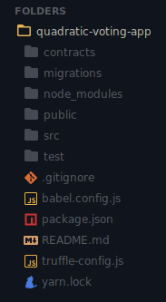
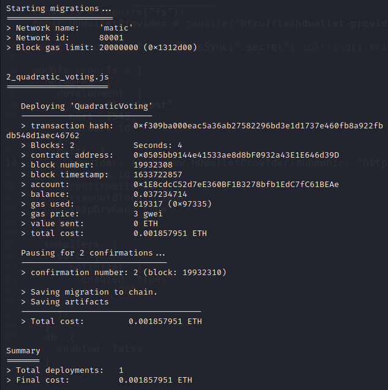

# Introduction

In this tutorial, we will be learning how to create a quadratic voting app with collaboratively managed ranked lists.

Here's a preview of what we will be building:


# Prerequisites

This tutorial assumes basic knowledge of blockchain, Solidity and Vue.js.

By the end of this tutorial you will be able to:

- Build a full stack dApp on the Ethereum blockchain
- Create smart contracts with Solidity
- Write tests for smart contracts
- Compile and migrate smart contracts with Truffle
- Build a front-end with Vue.js and TailwindCSS
- Call smart contract functions with Web3
- Serve images with IPFS
- Deploy smart contracts to the Polygon Mumbai testnet

# Requirements

## Node, NPM and Yarn

Node.js is a runtime environment that allows us to execute JavaScript outside of a web browser.

NPM and Yarn are package managers. Which you use is a matter of preference. We will be using Yarn in this tutorial.

1. Install Node.js [here](https://nodejs.org).
2. Check NPM installation: `npm -v`
3. Install yarn: `npm i -g yarn`

## Truffle

Truffle is a development environment for Ethereum that we will use to compile and deploy our smart contract.

`npm i -g truffle`

## MetaMask

MetaMask is a browser extension that allows you to access your Ethereum wallet and interact with dApps.

Install it [here](https://metamask.io/).

Use the following configuraton to add the Polygon Mumbai testnet.


## Other

These are the additional technologies we will be using:

- Solidity
- Polygon (Matic)
- Web3.js
- IPFS
- Vue.js
- TailwindCSS

# Project setup

To generate initial project files, we will use the Truffle and Vue cli tools.

```bash
npm i -g truffle @vue/cli

vue create quadratic-voting-app
> Default (Vue 3)
> Use Yarn

cd quadratic-voting-app
truffle init
```

Your project should look like this.



# Creating the smart contract in Solidity

Create a new file called `QuadraticVoting.sol` in the `contracts` folder.

```solidity
// SPDX-License-Identifier: MIT
pragma solidity >=0.4.0 <0.9.0;

contract QuadraticVoting {
  struct Item {
    address payable owner;
    uint amount;
    bytes32 title;
    bytes32 imageHash;
    string description;
    mapping(address => uint) positiveVotes;
    mapping(address => uint) negativeVotes;
  }
```

The primary data structure in our app is going to be the Item. Users will vote up or down on items to control their ranking, paying a fee that depends on the weight of their vote. Votes are quadratically funded, which means that anyone can add as much weight to their vote as they like, however, the price of submitting this vote will be the weight squared.

Any fee paid for a positive vote is rewarded to the creator of the item, creating an economy where the best suggestions, meaning the ones ranked the highest by others, receive the highest earnings. This incentivizes high quality, honest suggestions. Negative vote fees are redistributed to other items.

```solidity
  uint public voteCost = 10_000_000_000;

  mapping(uint => Item) public items;
  uint public itemCount = 0;
```

The variable `items` is a mapping of `itemId => item` and `itemCount` is the amount of items that have been created, as well as the next itemId to be used.

The `voteCost` constant is the price of a vote of weight 1 in terms of wei. One ether consists of 1,000,000,000,000,000,000 wei and one gwei consists of 1,000,000,000 wei. Therefore, `voteCost` is set to 10 gwei, or 0.00000001 ether. You can change this value to whatever you wish.

As an example of how quadratic voting works, let's say this contract was for a ranked list of the most favored Star Wars characters. One person may suggest Han Solo while another may suggest Chewbacca. If someone votes +2 for Han Solo, it will cost them `10 gwei * 2 * 2 =` 40 gwei. If someone votes +3 for Chewbacca, it will cost them `10 gwei * 3 * 3 =` 90 gwei. This leads to an ecosystem where a single person may vote more times than another if they care about the topic more, but it gets exponentially more expensive with each vote, ensuring a fair democracy.

```solidity
  event ItemCreated(uint itemId);
  event Voted(uint itemId, uint weight, bool positive);

  function createItem(bytes32 title, bytes32 imageHash, string memory description) public {
    uint itemId = itemCount++;
    Item storage item = items[itemId];
    item.owner = msg.sender;
    item.title = title;
    item.imageHash = imageHash;
    item.description = description;
    emit ItemCreated(itemId);
  }
```

The function `createItem` is used to publish a new Item object to the ranked list. The item will require a title, IPFS image hash and text description to be set before the object can be created. The current sender is considered the owner of the item.

This is an example of what a published item will look like when we build the UI:


```solidity
  function positiveVote(uint itemId, uint weight) public payable {
    Item storage item = items[itemId];
    require(msg.sender != item.owner);
    require(msg.value >= weight * weight * voteCost);
    item.positiveVotes[msg.sender] = weight;
    item.negativeVotes[msg.sender] = 0;
    item.amount += msg.value;
    emit Voted(itemId, weight, true);
  }
```

Users are not able to vote for their own items because this would allow them to claim what they spent and use it to vote again, essentially meaning they could infinitely vote on their own items. Therefore we need to make sure the sender is not the item owner. Also, the value of the transaction must be greater than or equal to `weight * weight * voteCost`.

```solidity
  function negativeVote(uint itemId, uint weight) public payable {
    Item storage item = items[itemId];
    require(msg.sender != item.owner);
    require(msg.value >= weight * weight * voteCost);
    item.negativeVotes[msg.sender] = weight;
    item.positiveVotes[msg.sender] = 0;

    uint reward = msg.value / (itemCount - 1);
    for (uint i = 0; i < itemCount; i++) {
      if (i != itemId) items[i].amount += reward;
    }

    emit Voted(itemId, weight, false);
  }

```

Negative votes are slightly different in their distribution. Rather than reward the owner for a poor addition to the list, the funds are distributed to everyone except the owner. This acts as a sort of basic income for all participants.

```solidity
  function claim(uint itemId) public {
    Item storage item = items[itemId];
    require(msg.sender == item.owner);
    item.owner.transfer(item.amount);
  }
}
```

This allows the owner of an item to transfer any reward to their wallet.

And there we go! Our smart contract is finished. Now let's learn how to deploy it.

# Compiling and deploying with Truffle

We'll need to compile our contracts before we can use them.

```bash
truffle compile
```

You should get similar output.


You can find the compiled contracts in the `build/contracts` directory.

Create a new file called `2_quadratic_voting.js` in the `migrations` folder.

```js
const QuadraticVoting = artifacts.require("QuadraticVoting")

module.exports = function (deployer) {
  deployer.deploy(QuadraticVoting)
}
```

Edit the `truffle-config.js` file to add the Matic Mumbai test network.

```js
const fs = require("fs");
const HDWalletProvider = require("@truffle/hdwallet-provider");

const mnemonic = fs.readFileSync(".secret").toString().trim();

module.exports = {
  networks: {
    development: {
      host: "localhost",
      port: 7545,
      network_id: "*",
    },
    matic: {
      provider: () => new HDWalletProvider(mnemonic, "https://rpc-mumbai.maticvigil.com/v1/{APP_ID}"),
      network_id: 80001,
      confirmations: 2,
      timeoutBlocks: 200,
      skipDryRun: true
    },
  },
  compilers: {
    solc: {
      optimizer: {
        enabled: true,
        runs: 200,
      },
    },
  },
  db: {
    enabled: false,
  },
}
```

We'll need to install the HD wallet provider.

```bash
yarn add -D @truffle/hdwallet-provider
```

In order to publish contracts to the blockchain we will need to pay the gas fees. Get testnet MATIC from the [Mumbai faucet](https://faucet.polygon.technology/) by inputting your wallet address.

Export your private key from MetaMask and put it in the `.secret` file, which will be used as the `mnemonic` variable in the config.

We'll need to create an account [here](https://rpc.maticvigil.com/) to have a quota for the RPC. Create an App and replace `{APP_ID}` in the config with the App Id.

Now we'll deploy our contracts to Polygon.

```bash
truffle migrate --network matic
```

You should see similar output.



# Writing tests for the smart contract

Next we will be writing tests for our contract. Tests allow us to ensure our contract code is working as intended in a programmatic way.

Create a file named `quadratic-voting-test.js` in the `test` directory.

```js
const QuadraticVoting = artifacts.require("QuadraticVoting");

contract("QuadraticVoting", (accounts) => {
  describe("deployment", () => {
    it("should be a valid contract address", () =>
      QuadraticVoting.deployed()
        .then((instance) => instance.address)
        .then((address) => {
          assert.notEqual(address, null)
          assert.notEqual(address, 0x0)
          assert.notEqual(address, "")
          assert.notEqual(address, undefined)
        })
    )
  })

  describe("items", () => {
    it("should be the correct item data", () => {
      let instance

      QuadraticVoting.deployed()
        .then((i) => (instance = i))
        .then(() => instance.createItem(
          web3.utils.utf8ToHex("Chewbacca"), // title
          web3.utils.utf8ToHex("ipfs_hash"), // imageHash
          "The ultimate furry.", // description
        ))
        .then(() => instance.itemCount())
        .then((count) => assert.equal(count, 1))
        .then(() => instance.items(0))
        .then((item) => {
          assert.equal(web3.utils.hexToUtf8(item.title), "Chewbacca")
          assert.equal(web3.utils.hexToUtf8(item.imageHash), "ipfs_hash")
          assert.equal(item.description, "The ultimate furry.")
        })
    })
  })
})
```

The Truffle testing suite uses [Chai](https://www.chaijs.com/) as its library for writing tests.

Tests are broken up into two groups: `deployment` and `items`. The `deployment` tests are used to ensure successful deployment and valid contract address. The `items` tests are used to ensure the correct item data is being published to the blockchain.

You may write additional tests for the remaining smart contract functions if you wish.

You will need to install [Ganache](https://www.trufflesuite.com/ganache) to set up a local development blockchain to run our tests on. Once it is downloaded select Quickstart. This will allow us to use the development network configured earlier.

```bash
truffle test
```

You should see similar output.


# Communicating with the smart contract with Web3

# Uploading image files with IPFS

# Creating the front-end with Vue.js

# Styling the components with TailwindCSS

# Conclusion

# About the author
