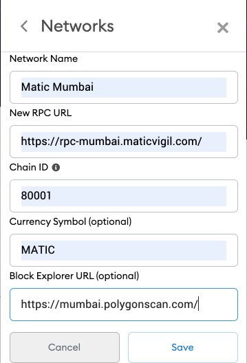

# Introduction

In this tutorial, we will be learning how to create a quadratic voting app with collaboratively managed ranked lists.

Here's a preview of what we will be building:


# Prerequisites

This tutorial assumes basic knowledge of blockchain, Solidity and Vue.js.

By the end of this tutorial you will be able to:

- Build a full stack dApp on the Ethereum blockchain
- Create smart contracts with Solidity
- Write tests for smart contracts
- Compile and migrate smart contracts with Truffle
- Build a front-end with Vue.js and TailwindCSS
- Call smart contract functions with Web3
- Serve images with IPFS
- Deploy smart contracts to the Polygon Mumbai testnet

# Requirements

## Node, NPM and Yarn

Node.js is a runtime environment that allows us to execute JavaScript outside of a web browser.

NPM and Yarn are package managers. Which you use is a matter of preference. We will be using Yarn in this tutorial.

1. Install Node.js [here](https://nodejs.org).
2. Check NPM installation: `npm -v`
3. Install yarn: `npm i -g yarn`

## Truffle

Truffle is a development environment for Ethereum that we will use to compile and deploy our smart contract.

`npm i -g truffle`

## MetaMask

MetaMask is a browser extension that allows you to access your Ethereum wallet and interact with dApps.

Install it [here](https://metamask.io/).

Use the following configuraton to add the Polygon Mumbai testnet:



## Other

These are the additional technologies we will be using:

- Solidity
- Polygon (Matic)
- Web3.js
- IPFS
- Vue.js
- TailwindCSS

# Project setup

To generate initial project files, we will use the Truffle and Vue cli tools.

```bash
npm i -g truffle @vue/cli

vue create quadratic-voting-app
> Default (Vue 3)
> Use Yarn

cd quadratic-voting-app
truffle init
```

Your project should look like this:


# Creating the smart contract in Solidity

Create a new file called `QuadraticVoting.sol` in the `contracts` folder.

```solidity
// SPDX-License-Identifier: MIT
pragma solidity >=0.4.0 <0.9.0;

contract QuadraticVoting {
	struct Item {
		address payable owner;
		uint amount;
		bytes32 title;
		bytes32 image_hash;
		string description;
		mapping(address => uint) positiveVotes;
		mapping(address => uint) negativeVotes;
	}
```

```solidity
	uint public voteCost = 10_000_000_000;

	mapping(uint => Item) public items;
	uint public itemCount = 0;
```

```solidity
	event ItemCreated(uint itemId);
	event Voted(uint itemId, uint votingPower, bool positive);

	function createItem(bytes32 title, bytes32 image_hash, string memory description) public {
		uint itemId = itemCount++;
		Item storage item = items[itemId];
		item.owner = msg.sender;
		item.title = title;
		item.image_hash = image_hash;
		item.description = description;
		emit ItemCreated(itemId);
	}
```

```solidity
	function positiveVote(uint itemId, uint votingPower) public payable {
		Item storage item = items[itemId];
		require(msg.sender != item.owner);
		require(msg.value >= votingPower * votingPower * voteCost);
		item.positiveVotes[msg.sender] = votingPower;
		item.negativeVotes[msg.sender] = 0;
		item.amount += msg.value;
		emit Voted(itemId, votingPower, true);
	}

	function negativeVote(uint itemId, uint votingPower) public payable {
		Item storage item = items[itemId];
		require(msg.sender != item.owner);
		require(msg.value >= votingPower * votingPower * voteCost);
		item.negativeVotes[msg.sender] = votingPower;
		item.positiveVotes[msg.sender] = 0;
		item.amount += msg.value;
		emit Voted(itemId, votingPower, false);
	}

	function claim(uint itemId) public {
		Item storage item = items[itemId];
		require(msg.sender == item.owner);
		item.owner.transfer(item.amount);
	}
}
```

# Compiling and deploying with Truffle

# Writing tests for the smart contract

# Creating the front-end with Vue.js

# Styling the components with TailwindCSS

# Communicating with the smart contract with Web3

# Uploading image files with IPFS

# Conclusion

# About the author
