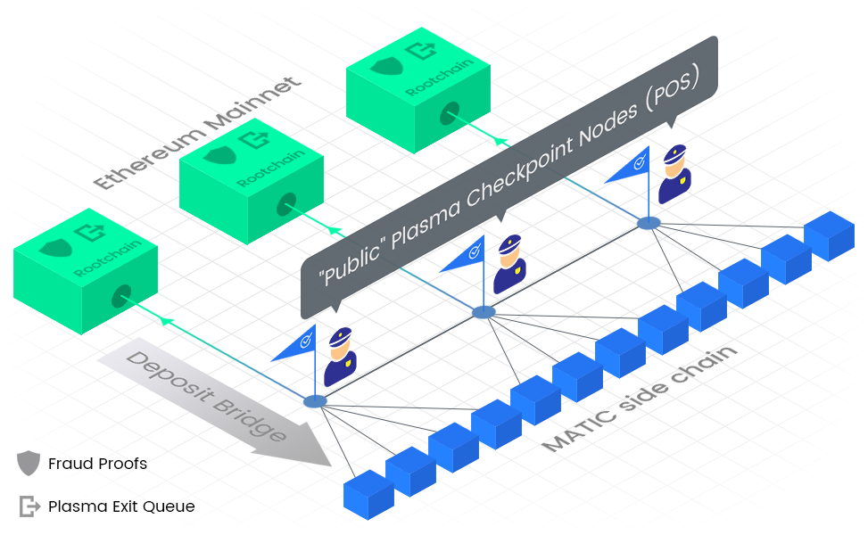
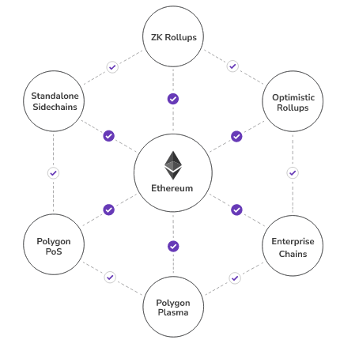

# A beginner's guide to Blockchain and Polygon

Before we jump into a discussion of explaining blockchain and Polygon stuff, let's get ourselves a pizza first. Before the pizza is delivered to your doorstep, I bet, you will learn all about the topic.

## Introduction

Before understanding the **Polygon Matic** and the problem it solves, let’s first have a quick overview on blockchain by ordering our favorite pizza, and learn what are **transactions, validators, block, consensus, proof of work, proof of stake**, etc.

### Visiting bizza.com - STATE and TRANSACTION

Let's visit a blockchain-based pizza site (**bizza**) and select a few pizzas of our choice. There are lots of pizzas to choose from. Currently, you are having 0 pizza in your cart. This is your **initial state**.

This online state is maintained on the blockchain by the community's computer (called nodes) and they will charge extra **fees** for maintaining states.

Once you select pizza in your cart, you need to submit a **transaction** to confirm your **final state** (type and number of pizzas). Apart from the pizza cost, this transaction is also accompanied by your signature to prove that this transaction is initiated by you and small service fees for processing your order.

**By submitting a transaction, you are trying to change the state.**

### Processing your order - VALIDATOR or NODE

Well, you are not the only one to order the pizza. People from all over your neighborhood might be ordering something. So there will lot of transactions.

But who will ensure that these transactions are valid i.e. customer has ordered a valid pizza, the address is genuine or they have the balance to buy the pizza? These tasks are done by **validators** or **nodes**. They do it for an extra service fee that you have included in your transaction. These are often referred to as **rewards**.

### Order accepted - CONSENSUS and PoW vs POS

Everyone wants to be a winner and earn rewards. So are the validators. They compete with each other to validate a transaction and change the state.

But among so many validators, how can all of them conclude that a particular validator has done the work and should be rewarded? Well, this is a question of a year-long research and is achieved through **consensus mechanisms**. There are various mechanisms and a lot of research is still going on to improve the efficiency of these mechanisms. 

Fighting for each transaction will take a lot of time. So instead they compete for a **block of transactions**. Whoever wins the competition will take the transaction fees in that block along with a reward. And their block will be added to the chain of previously validated blocks.

There are many consensus mechanisms to decide the winner. Two of the most famous ones are **Proof of Work** and **Proof of Stake**.

> Competing blocks of different validators may have overlapping transactions. But whoever loses, will have to remove the already included transaction from their block.
>
> Each block also contains a hash or say content identifier of the previous block. Thus we cannot alter the content of previous blocks, because this will change its hash, and hence we will need to change the hash in every succeeding block. This makes blockchain **immutable**.

### Proof of Work vs Proof of Stake

In the **PoW** mechanism, validators solve a cryptographical puzzle. Whoever solves the puzzle first will get to add their validated block in the chain and hence will be rewarded.

In the **PoS** mechanism, validators need to stake some assets (crypto coins in the blockchain). The amount staked and duration of stake increases the probability of the validator being chosen to add their block. There could be other factors apart from the amount and duration of stake.

> **PoS** is much faster than **PoW** and can handle more transactions per second. **PoW** uses brute force to solve a cryptographic puzzle whose complexity increases with the number of blocks added to the chain.

### Why my pizza is delayed - SCALABILITY ISSUES?

Is it because of the traffic on the road or did the oven just break? No no, everything is working fine. Your order got delayed due to two main reasons -

* High **time to finality** of your transaction. The more the time to finality, the more the time it will take to confirm your transaction. On the Ethereum network, it is around 1 - 6 minutes.

* Less number of **transactions per second** (tps). Our pizza site uses **Ethereum** network. It uses **PoW** consensus mechanism, which cannot scale to more than 15-20 tps. So if thousands of people are using the Ethereum network, then you have to wait for long, until your transaction is picked up by a validator.

These are called **scalability issues** of the **Ethereum** network.

## Who will process my pizza order, fastly? - MATIC

**Ethereum** is one of the most popular and secure blockchain networks, which is capable of running multi-purpose arbitrary transactions, which is defined by **smart contracts** (business logic). **But Ethereum is not scalable.**

Broadly speaking, there are two ways to scale a blockchain viz. **Layer 1 scaling** and **Layer 2 scaling**. In layer 1 scaling, changes or improvements are made by upgrading the main blockchain protocol. Whereas in layer 2 scaling, we try to bypass scalability obstacles without tweaking the main protocol. It may use smart contracts for interacting with the main chain.

Consider the main chain as a congested road, where at a time only 20 vehicles can pass. Now, this leads to long traffic jams, when around 100 vehicles approach.

There are two solutions to overcome this issue. Either we can broaden the road so that more vehicles can pass at a time (layer 1 solution), or we can make another broad highway bypassing the road so that this would divert some traffic to the highway (layer 2 solutions).

**Polygon Matic** focuses on layer 2 scaling. Some of the layer 2 scaling mechanisms -
* State channels
* Plasma chains
* ZK (zero-knowledge) Rollups
* Optimistic rollups

## How MATIC?

**Matic**, in 2017, came as a layer 2 scaling solution for the Ethereum network. Instead of building a new blockchain from scratch for faster transactions and low fees, Matic thrives to scale the Ethereum network itself. New projects can easily connect to the Matic network, and use the security and decentralization of Ethereum.

They have initially focused on the **Plasma chain** framework. These are small branch chains of the main chain, which helps in avoiding congestion on the main network.

In plasma chains, the consensus is achieved through **Proof-of-Stake**. **Validators** stake their MATIC tokens on individual plasma chains and validate the transaction off-chain. This increases transaction throughput and reduces fees. It regularly updates the Ethereum network with the regular snapshots of transactions happening on the Matic network for enjoying the security and decentralization of Ethereum.

## A deep dive into MATIC

Plasma chains can be used for specific applications like payments, asset swaps, etc. Polygon uses the hybrid of Plasma and PoS for running arbitrary applications on blockchain in a scalable way.

It has a 3 layer architecture -
* Staking and smart contract layer on Ethereum (base chain)
* PoS validator layer (contains nodes who staked on smart contract layer)
* Block producer layer (contains few nodes selected by PoS layer)

In Polygon, the Block producer layer is EVM (Ethereum Virtual Machine) compatible, which means it is capable of running smart contracts written in Solidity or made for Ethereum.

**Block Producer Layer**
General-purpose applications or smart contracts are deployed in this layer. All transactions happen in this layer and are put into the newly created blocks. Polygon promises the 1 second block creation time. Blocks are created by a few nodes selected by the PoS layer.

**PoS Validator layer**
This layer is responsible for submitting regular transaction reports on the main chain. This is necessary to utilize the security and decentralization offered by the Ethereum chain. This layer aggregates the blocks at regular intervals into Merkle root. This Merkle root contains the transaction reports of all the blocks in that interval. This Merkle root is then verified by all the nodes in this layer. Once verified a node selected in this layer publishes the Merkle root to the smart contract layer on the main chain. This is known as **checkpointing**. Till this checkpoint, all transactions on the Polygon chain are secured by Ethereum's security.

**Staking and Smart contract layer**
The smart contract on the main chain is responsible for maintaining checkpoints published by the PoS layer. It also involves staking from the various node to participate as a PoS layer validator. Users can stake their ETH to the smart contract and can participate in PoS layer validation.

## Rebranding Matic - Polygon

In February 2021, Matic revamped to **Polygon**, representing the integration of multiple layer 2 scaling solutions. Instead of only plasma chains as a solution, it will now offer -
* State channels
* Plasma chains
* ZK (zero-knowledge) Rollups
* Optimistic rollups

Polygon is often called the **Ethereum's Internet of Blockchain**. This is so because it aims to connect and scale all the Ethereum compatible blockchain networks just like the internet connects people. It thrives to make an ecosystem of Ethereum compatible scalable multichain, so that, every network can enjoy scalability, security, and decentralization at the same time. 

> A blockchain is Ethereum compatible if we can run smart contracts written for Ethereum on that blockchain.

## Plans of Polygon

One of the plans is obviously to connect every Ethereum compatible blockchain to a scalable ecosystem. And other plans are to integrate other scalability solutions like ZK-Rollups, Optimistic Rollups on the platform.

## Conclusion

This article's main aim was to focus on Polygon's technology. But it cannot be understood if you do not know what blockchains are, what problems they are facing, and available solutions. Since Polygon is all about solving problems faced by contemporary blockchains, it was really important to understand them first. This would also help crypto investors who want to invest in blockchain technologies but cannot understand their highly technical whitepapers (research).

I am assuming your pizza isn't delivered yet, and you learned a lot of things about Polygon and blockchain ;)

## About the author
I am [Raj Ranjan](https://www.linkedin.com/in/iamrajranjan) and I have written this article. Thank you ;)