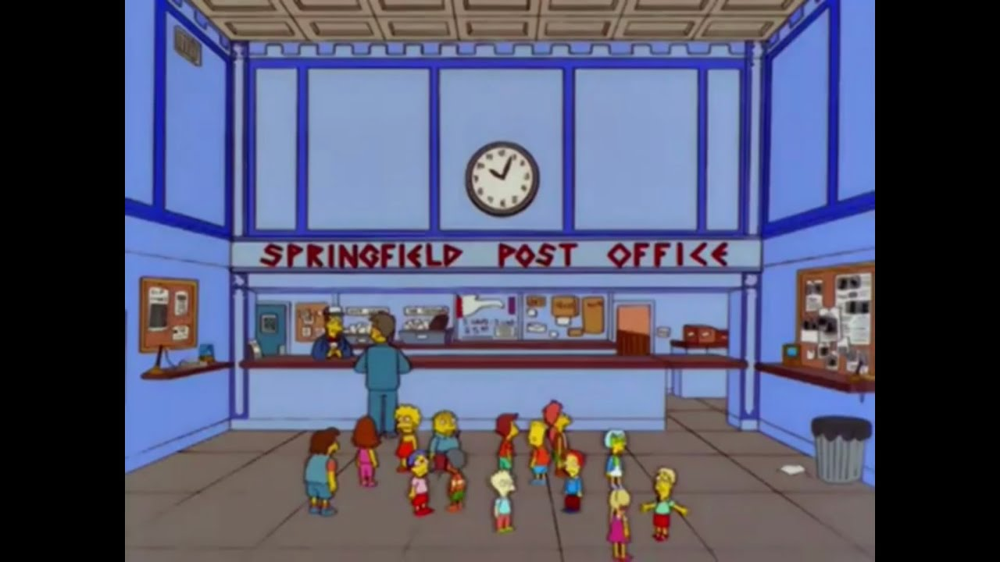
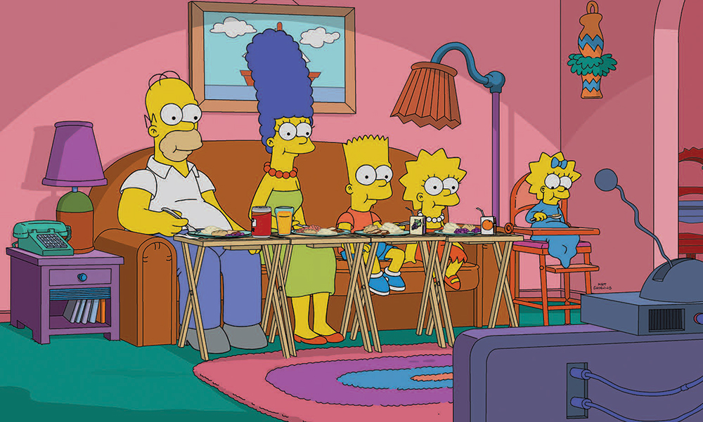
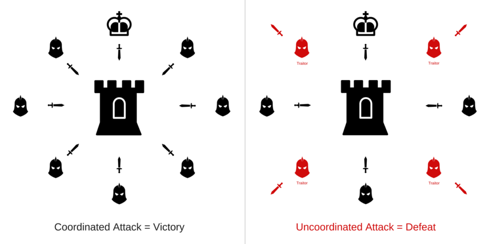
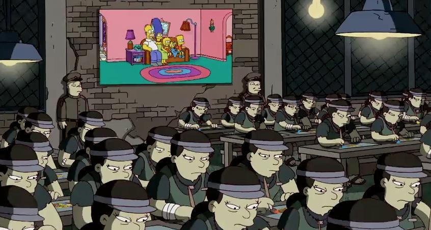
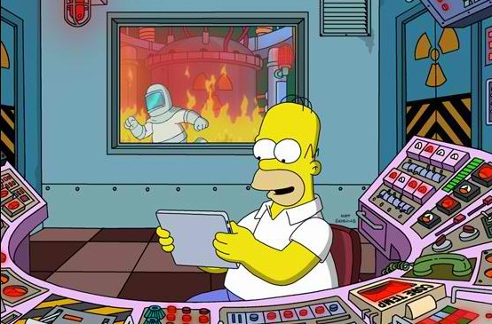
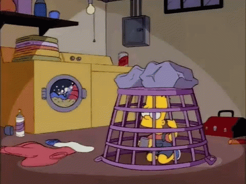
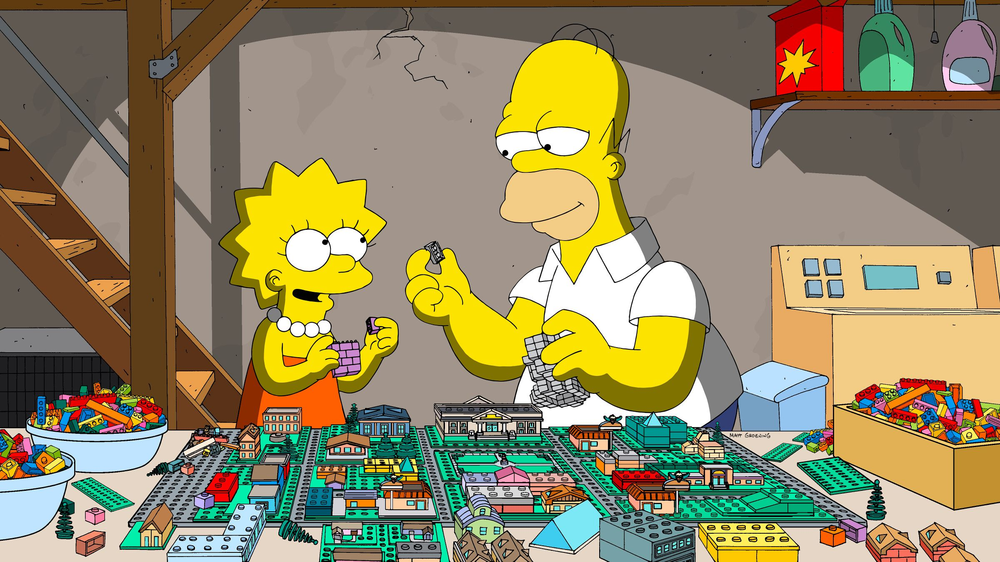
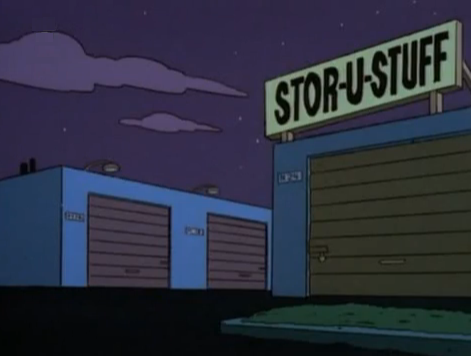

# Explaining Blockchain with The Simpsons

# Introduction

If you’re over 30’s I bet you’re familiar with The Simpsons sitcom, right?

Homer, Marge, Bart, Lisa, and Maggie.

Could you believe I can teach you Blockchain principles and SOLANAS’s innovation using these characters as an illustration?

Let’s dive in, then you can judge me later.

Before we jump right into SOLANA's eight innovations, let’s slow down and learn about three core concepts which will help us ground the basics to this article.

**Blockchain, Transactions and Consensus.**

The name of this “episode” is: _“Sending letters to grandpa!”_

Bart, Lisa, and Maggie are writing letters to Grampa Simpson. Each one of them needs to write onto the envelope the usual information: the sender, the receiver, and inside of the envelope, the content, right? Pretty straightforward.

Like any non-anonymous normal letter, Bart, Lisa, and Maggie need to add two things to it.

They need to sign the letter and then seal it with a stamp.

Unlike normal stamps, these stamps are derived from the information within the letter, thus becoming unique for each letter. If any information changes within the letter, the stamp also changes. In blockchain’s transaction, this “stamp” is called a hash.

This high-level analogy explains **transactions** on a blockchain. Each “letter” is a **transaction**, which has data about sender, receiver, content, signature (produced by your private key), a hash (which is the stamp of our Simpsons episode), and some useful additional metadata.

**Let’s keep watching The Simpsons together?**

After writing, Bart, Lisa, and Maggie need to send their letters to their parents (the validators).

Homer and Marge are the **validators** of the letters (transactions), and their job is to validate and agree upon some requirements these letters should have.

If the letter fails their validation consensus, the letter isn’t sent to be inserted into a box at all.

After they validate, they now need to send the letters (transactions) to the Post Office chain.

When the letters (transactions) arrive to the Post Office chain (blockchain), the Post Office has many packers (miners or forgers) competing with each other to store these letters in their own box.

After their boxes get full, they now need to decide whose box (called block in a blockchain) to include onto the chain. This is the concept of **_Consensus Methods_**.

Currently, we have three major consensus methods broadly used in blockchain.

**Proof of Work, Proof of Stake, and delegated Proof of Stake.**

In this article, we are going to explore the first two.

In **Proof Of Work**, the packers are called miners and they will compete against each other to solve a puzzle. Whoever solves it first, gets the right to add their box (block) to the chain.

In **Proof Of Stake** the packers are called forgers and the competition is money based. They will have to stake their coins into a _“jar”_. They will compare who has more coins, how long those coins are in the jar, and some other attributes. There’s also a random factor to choose one of them, allowing all packers (forgers) to add its box.

In both methods, every box (block) must have a pointer to the previous box (block), a stamp (hash), which is derived by its content, and some useful additional metadata, to be included into the chain.

**In a nutshell, a block is a group of validated transactions.**

Every new box (block) is linked with the previous one. This forms a chain of boxes (blocks).

This high-level analogy explains **_transaction validation_** and **_Consensus Methods_** in a blockchain.

SUMMARY: **This episode taught you important blockchain concepts, like what is a blockchain, what is a transaction and how consensus methods work.**

# SOLANA'S INNOVATIONS

## Briefing

**SOLANA** ecosystem has taken the blockchain world by storm, bringing some amazing innovations which empower SOLANA to achieve performance and security like never before.

SOLANA also solves the blockchain trilemma: Decentralization, Scalability, and Security.

Solana’s innovative approach is organized into eight pillars, which we’re going to learn as described in the following pages.

1. Proof of history
2. Tower BFT
3. Turbine
4. Gulf Stream
5. Sea Level
6. Pipelining
7. Cloudbreak
8. Archivers

**Now let’s watch a different episode. Let’s jump right into the SOLANA’s eight innovations.**

## First Innovation: PROOF OF HISTORY

We already learned about two Consensus Methods used in blockchains nowadays, right?
In SOLANA’s blockchain, we use Proof of Stake as this method offers a more democratic and fairer way for the validators as compared to Proof of Work.

Unfortunately, both methods share a common bottleneck. Time synchronisation among validators when reaching consensus.

Solana fixes this using a pre-consensus approach, called Proof of History.

Let’s visit Springfield and learn about it.

Imagine that Marge needs to take Bart to a medical appointment. Before going to a specific medical facility, Marge needs to use a universal take-a-number system common to all medical facilities, to prove she scheduled her appointment at a specific point in time.

As Marge now has a ticket with her number, she called a call center and was told to drive to the medical facility “A”. She then drives for ten minutes until she gets there.

When she arrives, she notices two more people in the waiting room already. Despite those two people having arrived earlier, the receptionist calls Marge asking for her proof of appointment (with the time it was issued).

Once Marge presents it, the receptionist allows Bart and Marge to enter the clinic immediately.

This system allows all the patients to be ordered by their timestamp despite the time of arriving at a medical facility, at different times. It also allows them to be redirected to the next medical facility based on the knowledge of which patients’ tickets are treated by each facility avoiding unnecessary waiting time.

That’s Proof of History in SOLANA’s blockchain. It’s a way to avoid unnecessary waiting time for external actors’ confirmation to achieve consensus as there’s a decentralized clock guaranteeing ordering of events.

Proof of history represents the attachment of a unique cryptographic timestamp into the transaction, generated by a VDF (verifiable delay function), meaning that each transaction itself carries a time record registering that this transaction happened in a specific point in time, thus easily verifiable and able to be ordered.

When this transaction goes to a validator, the validator doesn’t need to communicate with any external sources to know when the transaction happened, he just needs to look at the timestamp and order the transactions, exactly as the receptionist ordered the patients in Springfield. Each validator has its own internal “clock”, thus avoiding dependency on external confirmations.

Another huge advantage of SOLANA Proof of Stake is based on the deterministic approach on leader election. All validators know beforehand who’s the next leader validator.

## Second Innovation: TOWER BFT

Before speaking about Tower BFT (aka. Tower Byzantine Fault Tolerance), let’s do a quick analogy to explain the problem it solves.

The Byzantine Generals Problem.

The Byzantine Generals Problem comes into play when more than two generals have to come to a common agreement on whether to attack or retreat, but can communicate only by sending messengers who might never arrive.

Some generals may also be traitors and can try to spread different information to other generals, leading to a catastrophic failure.

To avoid a failure or inability to communicate properly impacts the function of the entire blockchain, a fault tolerance system needs to be implemented.

The Tower BFT (Tower Byzantine Fault Tolerance) ensures that the blockchain will remain functional even if 1/3 of the nodes get faulty.

Even if 1/3 of the generals are compromised, the war strategy gets executed with success thus bringing victory to the army.

To avoid the communication bottleneck, once a “general” (node/validator) votes for a plan “A”, he commits he won’t vote to any other plan which isn’t derived from plan “A” for at least two rounds.

Every time the generals vote on a derived plan from plan “A”, plan “A” weights doubles, meaning it's hard to rollback.

But how do we guarantee that all generals are alive and properly sending messengers? How do we make sure they are even retransmitting the right message?

Each vote sent by the generals carries a small sequence of verifiable information that gets updated (increased) on each vote, meaning if a messenger delivers a vote with this sequence missing any info, the vote is discarded.

## Third Innovation: TURBINE

Using The Simpsons analogy, imagine how communication would be delayed if instead of having just 5 packers on the Springfield Post Office (to add a box (block) onto the chain), we have 100 packers.

They need to communicate among themselves to send a copy of the box (block) to each packer. But some may have a more limited channel of communication between them. If they live far from each other, the time they will take to communicate and send this copy among them, can increase dramatically.

This limitation on their communication channel it’s called bandwidth.

When a packer closes a box with the letters and adds onto the chain, he needs to send a copy of that box (block) to all the other packers. They all need to have the same structure (chain), because next time one of them could ending up being the chosen one (leader) to add a box (forge the block and add to the blockchain), and since no box can enter the chain without linking with the previous one, all validators need to be on the same page.

**This is called block propagation.**

Now, imagine the leader packer needing to send his box (block) to all the other packers (validators). Assuming each box weighs 128 kilos, the leader packer would invest a lot of resources (time and effort) to send 128 kilos times all the packers. It’s a ton of work!

Instead, the leader packer found a way to split a big box into smaller boxes of 640gr, then sending the smaller ones to his closest packers (validators).

Because each packer would have some small boxes but not all, they also need to make a copy of the small boxes they just received and then resend/retransmit to their closest packers too. This way, all the packers will keep receiving small boxes, pretty much like a puzzle, until they receive all necessary boxes to recreate the big one.

This is called **Turbine** and is the way to split a 128MB block into small packages of 64kb and send them to the leader node’s neighborhood (closest validators). These nodes also need to retransmit these small packages onto their neighborhood until all validators receive all packages necessary to recreate the block.

However, there’s a catch on this approach. What if one malicious neighbor (Frank Grimes from Simpsons analogy. Do you remember him?) doesn’t retransmit some small packages to his neighbor? What if he changes the content?

In this case, each small package has a cryptographic “build a block user manual” attached to it, allowing the recreation of missing blocks.

**This is called erasure codes.**

This high-level analogy explains **block propagation using Turbine technique** and **erasure codes** in Solana’s blockchain.

## Fourth Innovation: GULF STREAM

Before explaining **Gulf Stream**, let’s speak about **mempool**.

You can think about mempool as a waiting queue for the blockchain. Using Springfield’s analogy it's the waiting queue of Springfield Post Office. A mempool is a set of valid transactions that have been submitted, but have not yet been processed by the network.

The problem is that the size of the “waiting queue” can dramatically vary as the supply and demand balance between number of transactions (letters) and validators (packers) changes. If the number of transactions (letters) increase dramatically fast, the validators (packers) will become overloaded, thus decreasing performance, and increasing the mempool.

**So, how does Solana do better?**

In the Solana blockchain, each validator knows the order of upcoming leaders. Then instead of parking transactions to wait for available validators, Solana forward transactions to upcoming leaders, allowing them to execute transactions ahead of time, reduce confirmation times, switch leaders faster, and reduce the memory pressure on validators from the unconfirmed transaction pool.

Instead of the letters sent to the Springfield Post Office having to wait for the current box to get closed and added to the chain, thus the availability of one of the next packers, etc. They can organize letters into the next boxes waiting only for the leader to assume his position, close and stamp the box, then add it to the chain.

## Fifth Innovation: SEALEVEL

Do you remember The Springfield Nuclear Power Plant where Homer used to “work”?

We’re going to use it in our analogy for this innovation. But, before explaining what **Sealevel** means, we need to clarify two popular terms specially on Ethereum ecosystem:

**Smart-contracts and EVMs.**

**Smart-contracts** in a blockchain are just programs (code) developed by programmers and deployed (made available) on the blockchain to be used (called) by anyone within that blockchain. Roger that?

**EVM (Ethereum Virtual Machine)** is where these codes run. It’s like a magic box where the Smart-contracts are executed.

Back to the Nuclear Power Plant, imagine that to prevent Homer from making any stupid mistake and blow the place up, a bunch of procedures has been written using punched card
and made available to be used by him to execute certain tasks.

Because punched cards are made using metal, this means it cannot be updated/changed. If you need to change anything, you need to create a new version of the punched card.

**These punched cards are our smart-contracts.**

To execute the tasks, Homer needs to insert these punched cards into an execution box. Only through these boxes the tasks registered in the punched card gets executed.

**These boxes are the EVMs.**

**Back to SOLANA**, a normal EVM has a limitation of single-thread processing, which means they can only execute one smart-contract at a time. SOLANA implements something called **Sealevel**, which allows smart-contract to be executed in parallel.

How do they do that?

Every smart-contract reads and/or writes data through transactions. Because SOLANA smart contracts describe which data (we call this as state) will be read/write in runtime, SOLANA ensures parallel processing among smart-contracts that won’t manipulate (write) the same state avoiding writing concurrency.

Smart-contracts which run transactions that are read only, also run in parallel.

## Sixth Innovation: PIPELINING

Let’s use a metaphor to explain Pipelining.

There is a washer, a dryer and a folding machine. Guess what?! Wash/dry/fold several loads of laundry in sequence. Washing must occur before drying and drying before folding, but each of the three operations is performed by a separate unit.

To maximize efficiency, one creates a pipeline of stages. We’ll call the washer one stage, the dryer another, and the folding process a third. To run the pipeline, one adds a second load of laundry to the washer just after the first load is added to the dryer. Likewise, the third load is added to the washer after the second is in the dryer and the first is being folded. In this way, one can make progress on three loads of laundry simultaneously. Given infinite loads, the pipeline will consistently complete a load at the rate of the slowest stage in the pipeline.

So Pipelining is an appropriate process when there’s a stream of input data that needs to be processed by a sequence of steps and there’s different hardware responsible for each step.

## Seventh Innovation: CLOUDBREAK

Cloudbreak in a nutshell is how SOLANA organizes its data in a particular structure to achieve concurrent read and write operations in an optimal way.

Imagine Lisa was asking for a long time the whole family to assemble a Washington Lego city replica with her. After postponing for a while, they finally decided to do it. Before they accepted the task, Homer asked Bart, Lisa, and Margie to organize all the pieces by color and shape.

This is a sequential writing example.

Now instead of looking at a bunch of mixed pieces, they have small glass jars where they can easily pick the size and color needed.

Although they can access the desired Lego piece in a random fashion among the jars (read), Bart, Lisa, and Margie will always store (write) using the separation approach explained above, ending up with a sequential organization.

Another benefit of this approach is that Homer has different shelves at home (types of storages, i.e. RAM, SSDs, etc.) to store these jars. Each shelf can be near or far from the kid’s dormitory, which can lead to a faster or slower access to the pieces when they need it later.

Knowing that Bart usually accesses a group of Lego pieces with a specific shape and color, more often than the others, Homer then places that in a shelf (RAM) next to Bart’s room.

If the pieces weren’t organized sequentially and divided by importance, this would be impossible to achieve.

That’s an analogy of how SOLANA organizes the database of accounts (more important Lego pieces) such that concurrent read and write are possible.

## Eighth Innovation: ARCHIVERS

As you can imagine, as a blockchain grows in usage, more and more data is created, thus the size of the ledger gets heavier to be stored by its nodes.

To solve this, SOLANA implements something called Archivers.

Imagine you must store a bunch of documents. You go to a storage facility and propose an agreement with all the unit owners. If they have available space, they need to contact you, then you will send documents to their units in a continuous manner up to their full capacity.

With some frequency, the unit owners (Archivers) will be challenged to prove they’re storing our documents (data), at which point they must complete a proof of storage (a proof of replication (PoRep) in SOLANA’s terms).

This allows validators not to have the obligation to have the full ledger stored but keep only a fraction of it, thus working with a “lighter ledger”.

That’s a high level of how archivers nodes work in SOLANA’s ecosystem.

# About the Author

Hey, my name is Jonathan Ferreira, and I'm a software developer in constant evolution, seeking knowledge acquiring and sharing. Learning and implementing blockchain technology, and specially intereseted about Solana ecosystem.

My GitHub: [https://github.com/Jonathansoufer](https://https://github.com/Jonathansoufer)

In case you found any misinformation in the article or had any suggestions to improve the article please comment it or you can find me on Twitter: [@JSoufer](https://twitter.com/JSoufer).

# References

Solana's Medium: [7 Innovations that maskes Solana the First Web Scale Blockchain - Medium!](https://medium.com/solana-labs/7-innovations-that-make-solana-the-first-web-scale-blockchain-ddc50b1defda)

Bitcoin mempool : [Blockchain Mempool!](https://www.blockchain.com/charts/mempool-size)

Solanians's Twitter : [https://twitter.com/solanians\_](https://twitter.com/solanians_)

Solana's Medium: [Solana's Documentation!](https://2501babe.github.io/posts/solana101.html)
