# Explaining Solana and its Innovations without technical jargon

Think of a world where people can pay each other without the help of a bank or a third-party service. Users' data is not getting sold for commercial purposes. Decentralized markets exist where users and producers interact and make P2P payments without unfair market owner commissions.

That's just a glance at the financial utopia. The concept of decentralized finance and the web3 is alluring. But what makes a blockchain the right one to build next-generation web3 apps on it?!

well, it needs to be:

- fast
- cheap in transactions
- secure
- censorship-resistant
- scalable

In the current climate in the blockchain environment, it is hard to find one whit all above. one may provide fast transactions, another one providing cheap transactions, just a few can claim they're providing all features above.

Solana is the blockchain that offers all the fantastic features above. That makes it the best platform for all sorts of decentralized apps.

Solana has handled up to **65,000 transactions per second** at its peak with a **block time of 400ms**.

Transactions on Solana are unbelievably cheap. **The average cost of a transaction is $0.00025**.

**It supports smart contracts**. Developers can deploy their apps to Solana and take advantage of its features.

All of these features are mind-blowing 🤯! I'm sure I made you curious how all of these are possible without a trade-off or a pain point! Don't worry! I prepared the answer as well😅!

There are foundational innovations Solana has introduced to the blockchain world. These innovations are:

1. Proof of history
2. Tower BFT
3. Turbine
4. Gulf Stream
5. Archivers
6. Sea Level
7. Pipelining
8. Cloudbreak

## 1- Proof of History

Proof of History (PoH) is the core innovation of Solana which all other ones are built upon it. For a blockchain to work, participant nodes need to reach an agreement on time. Traditional blockchains like Bitcoin function by proof of work. Solana has done a revolutionary move by using a consensus model called PoH.

PoH is a verifiable delay function. This function produces unique output for an input. This function uses SHA-256 so one can't calculate input from the output. This nature of the function makes fast verification possible in Solana.

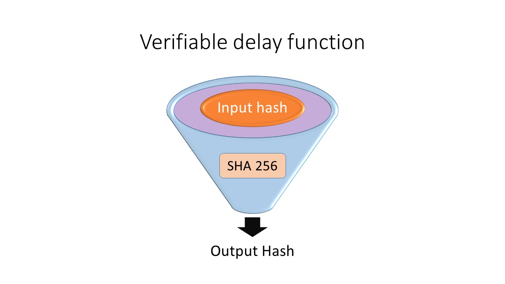

The whole philosophy behind it is:

- Running the function takes some time
- Running the function is the only way to produce the output
- When one has input and output of the function, the only way of evaluating the output is to re-execute the function by provided input

This guarantees when output is valid for input, some time has passed for producing the output. This is the magic behind Solana!

The ledger in Solana is a chain of blocks. Each block contains some transactions making the size of a block 10MB.

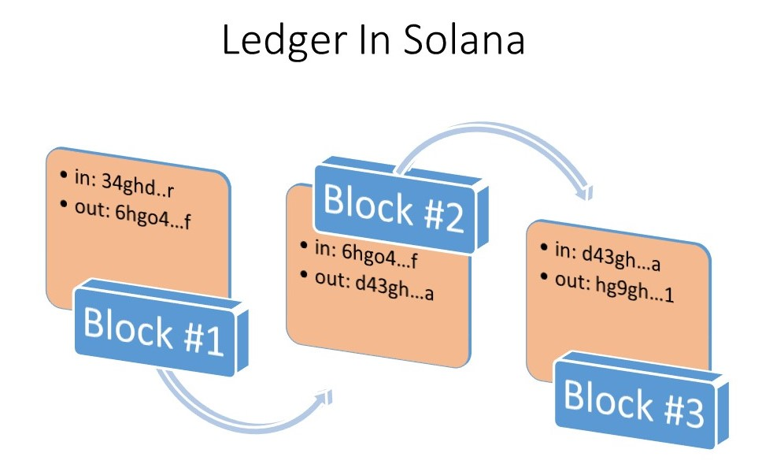

blocks in Solana ledger

Besides input and output hashes some other metadata is attached to each block like the number of transactions and events in it. When a node claims that he has created a new block to add to the ledger, this claim is verifiable by other nodes. The Node that generated the block is called Leader and validator Nodes are called validator.

Validators to validate the new block run the delay function for the number of transactions existing in the block and compare outputs with outputs provided by the leader node.

Nodes when proposing a new block can reference one of the recently confirmed hashes in the ledger. This way they are proving that their block is generated after the referenced hash.

**Ok, it sounds a bit abstract! here is an example:**

imagine you have traveled in time to the year 2200! you're telling people that you're coming from the past but they are just laughing and calling you a liar. you are angry like 😡 but suddenly an idea comes into your brain.

You show them a 100$ bill minted in the 2000 year. First, they suspect that it's a fake bill so they start analyzing it in their labs. After they ascertained you're telling the truth they cuddle you and trust you!

An adorable story but let's map its elements to PoH:

- Time traveler in the story is equivalent to the node that generated a new Block
- The claim of coming from the past is equivalent to the newly generated block
- 100$ bill is equivalent to referenced hash from the ledger
- Analyzing the bill in labs is equivalent to validating the block by validators

## 2- Tower BFT

Byzantine is an old problem discussing the problem of deciding upon a solution or decision for a question or a challenge where there is more than one solution or proposal with a different number of votes for them.

Tower BFT is Solana’s custom implementation of PBFT which takes advantage of PoH as a global clock to reduce message overhead and latency. This implementation uses PoH as a reliable source of time and the exponentially-increasing time-outs to select the most valid forks.

In the chart below we see a conflict over Hash #4. Both Hashes claim to be a valid child for Hash #3 but just one can get accepted.

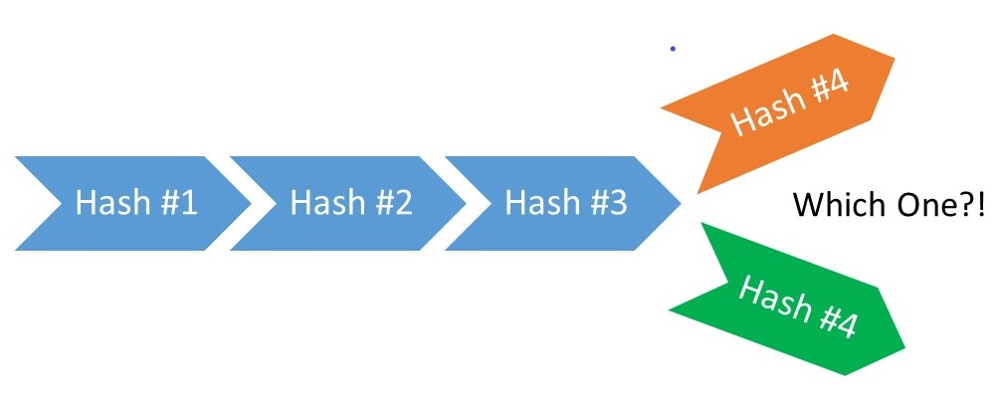

Validators after validating a block submit their vote for that block ( referred as hash here ).

For each hash in the ledger, validators can submit their votes for that specific hash at a vote stack dedicated for it. In the example above both hashes are trying to get confirmed and become hash #4. both of them have a vote stack. In the end, the one with the largest vote stack is going to win this competition, and validators who voted on the winner are going to be rewarded.

This mechanism of reward for votes on the right hash encourages validators to vote on the fork with the largest vote stack since it’s likelier to be the valid one.

The slot is the number of hashes that represent about 400ms. Every 400ms, the network has a potential rollback phase. Considering each vote, every subsequent vote coming after it doubles the amount of real-time the network needs to wait to unroll it from the votes stack.

**We love examples so let’s dissect this rule by an example:**

assume that validators started validating orange hash from figure above and a vote stack has been created as below:


It looks like a pyramid because votes are different depending on the order of their entrance to the stack.

We measure time in slots for the vote stack. Let's assume the first vote gets submitted by a validator to stack at time 1. Then vote stack would be as below:

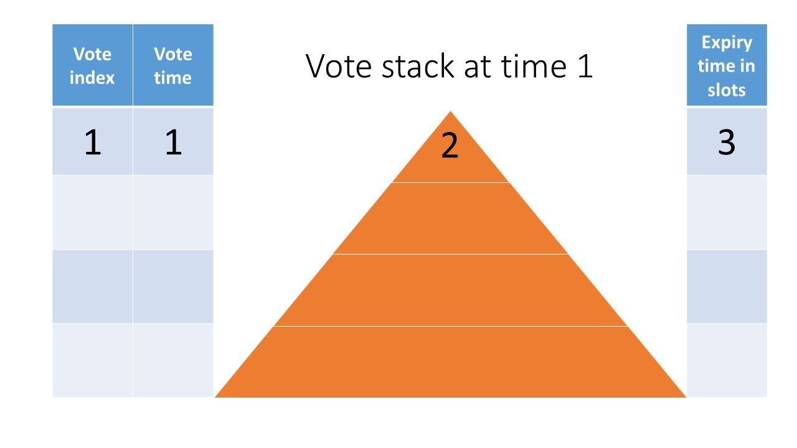

The expiry time is the time that the submitted vote gets popped out of the stack along with all votes being submitted after it (i.e. votes above the popped out vote with a higher vote index).

Expiry time for a vote is calculated by “ Vote time + current lockout in the stack”.

1 slot (i.e. ~400ms) later another vote gets submitted, so the new vote stack would be like below:


Now we are familiar with the math and logic of voting. A vote gets submitted at time 5. At time 5, vote number 2 is expired and popped out. So vote stack would be like below:

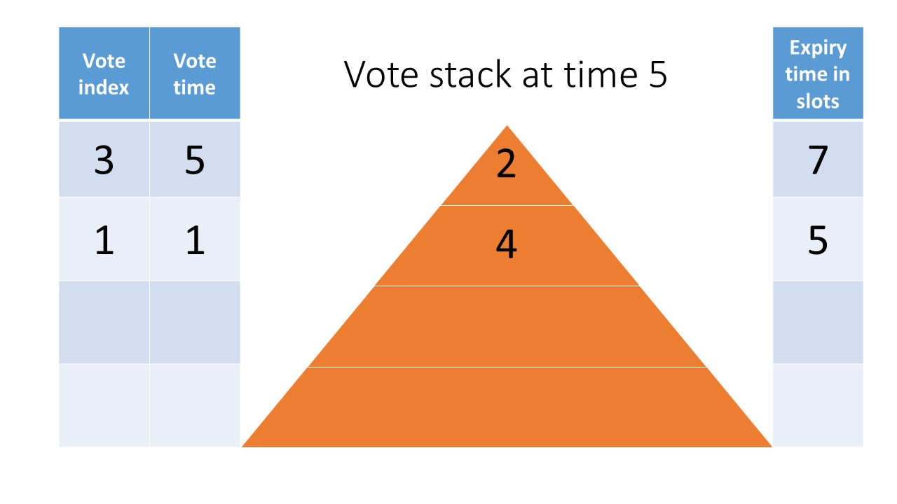

Although a new vote gets submitted to the stack, it doesn’t double the lockout time for vote 1 because doubling in lockout times happens only when votes need to move to larger positions in the pyramid.

At time 6 vote 1 gets expired and gets popped out along with all votes submitted after it ( which includes vote 3). So our vote stack is empty again.

Now that we are familiar with the logic of it let's travel in time to 18 and take a look at the vote stack:


At 19 we have 4 votes in stack and vote 7 is about to expire but another vote gets submitted:

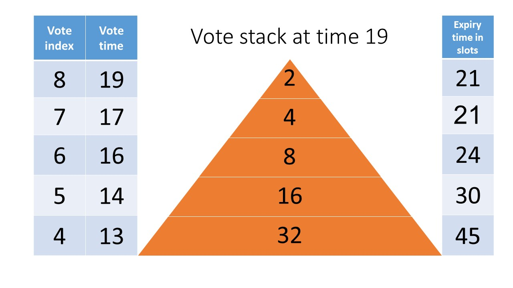

As more votes get submitted by validators stack grows in size and the expiry time for older votes increases as well. When stack size reaches 32, the lockout number for the oldest vote is 2^32 slots which is around 54 years! with a high chance, almost certainly, this vote would never be rolled back.

To reward validators who voted on the right hash, when a new vote is being submitted to a stack with 32 votes in it, the oldest one would be dequeued from the stack (i.e. first in first out) and its validator receives a reward.

This mechanism sounds similar to what happens at the proof of stake but they are distinct in one important part. In Power PBT when 2/3 of validators vote on a PoH hash it would be considered as confirmed and cannot be rolled back.

Another advantage of this approach is that every participant in the network can compute the timeouts for every other participant without any P2P communications. This makes Tower BFT asynchronous.

## 3 - Turbine

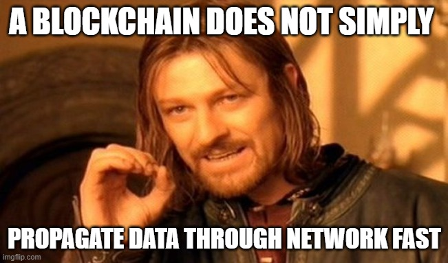

Is it just me or the man in the meme looks like the CEO of Solana Anatoly Yakovenko 😂

Scalability is hard since adding on the number of nodes in the network results in the more time needed for nodes to propagate data among each other.

Consider a leader trying to share 64MB of data (around 250,000 transactions assuming each transaction around 256 bytes) with other 20,000 validators. The very naïve approach would require leader to send the data to all other nodes at the network by P2P communication. And that simply means leader should have a unique connection with each one of validators and send 64MB of data to each one separately.

That is neither fast nor efficient! That’s why Solana came up with Turbine to solve this issue. Turbine is a protocol used by Solana to propagate blocks through the network fast and securely.

Turbine stablishes a random path per data packet through the network when a leader node is streaming data to other nodes in the network.

The leader splits the block into packets up to 64KB in size. For a 64MB block ( around 250,000 transactions considering each transaction around 256 bytes) the leader produces 1,000 of 64KB packets, and transmits each packet to a different validator.

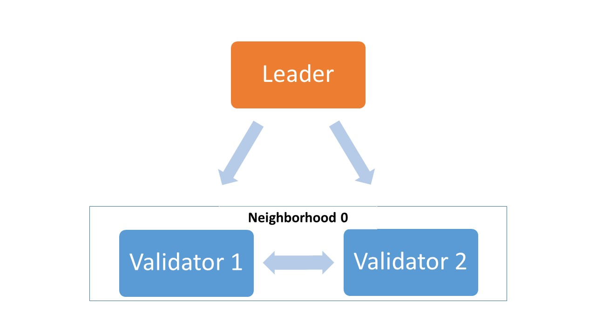

In turn, each validator retransmits the packet to a group of peers that we call a neighborhood. You can think of the network as a tree of neighborhoods which allows the network to grow beyond 1,000 validators:


tree of network from eyes of the leader

Each node in a neighborhood is responsible for transmitting the data it receives with other nodes in its neighborhood and propagating a portion of its data to a small set of nodes in other neighborhoods.

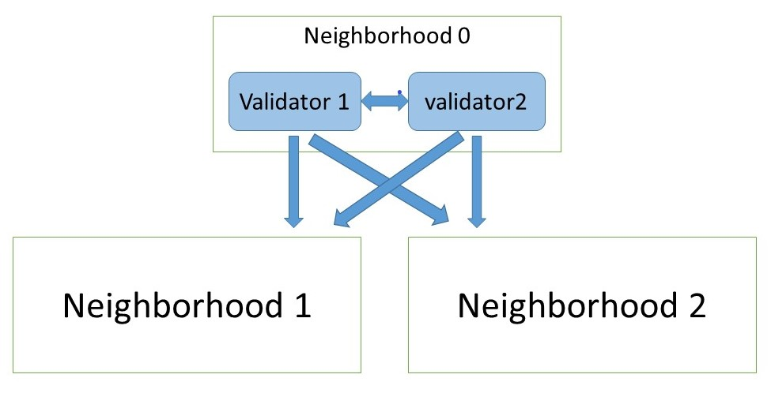

In all diagrams above for simplicity we have assumed each neighborhood consists of 2 nodes. In Turbine there is a parameter called `DATA_PLANE_FANOUT` which specifies the maximum number of nodes in any neighborhood. With that being said so far we have seen diagrams with `DATA_PLANE_FANOUT = 2`. This parameter also determines the shape of tree.

You can think of network tree creation by simple sudo-code below:

```
LAYER = 0
NEIGHBORHOOD = 0
// run till all nodes are allocated to a layer and neighborhood 
While ( NODES_IN_NETWORK > 0 ) {

		// if maximum amount of neighborhoods in a layer is reached moves to next layer
    If ( NEIGHBORHOOD+1 > DATA_PLANE_FANOUT^LAYER ) {
        LAYER = LAYER + 1
    }

		// if there were equal or more nodes than DATA_PLANE_FANOUT the create a full neighborhood
    If (NODES_IN_NETWORK > DATA_PLANE_FANOUT ) {    
				NODES_IN_NETWORK = NODES_IN_NETWORK - DATA_PLANE_FANOUT
				Create the Neighborhood number [NEIGHBORHOOD] at layer [LAYER] with [DATA_PLANE_FANOUT] nodes
	      NEIGHBORHOOD = NEIGHBORHOOD + 1
    }

		// if there were less nodes than DATA_PLANE_OUT create the last neighbor hood with remaining nodes
    Else {
        NODES_IN_NETWORK = 0
        Create the Neighborhood number [NEIGHBORHOOD] at layer [LAYER] with [NODES_IN_NETWORK] nodes
    }
}
```

So for `DATA_PLANE_FANOUT = 3`, `NODES_IN_NETWORK = 39` the tree is like below:

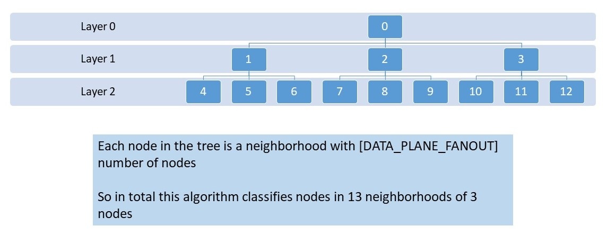

In a network with `DATA_PLANE_FANOUT = 200`, a leader at top can reach up to 40,000 (200*200) validators in 2 jumps in tree. Which tacks 200ms assuming each link inside network 100ms on average.

With fast propagation of data comes security concerns . A malicious node may choose to not rebroadcast the data it receives or even rebroadcast incorrect data to other nodes. To address this issue the leader creates Reed-Solomon erasure codes. Erasure codes allow each validator to reconstruct the entire block without receiving all the packets.

If the leader sends 30% of packets as erasure codes, then the network can drop any 30% of the packets without losing the block. Leaders can even adjust this number based on network conditions. These adjustments are made by the leaders’ observed packet drop rate from previous blocks.

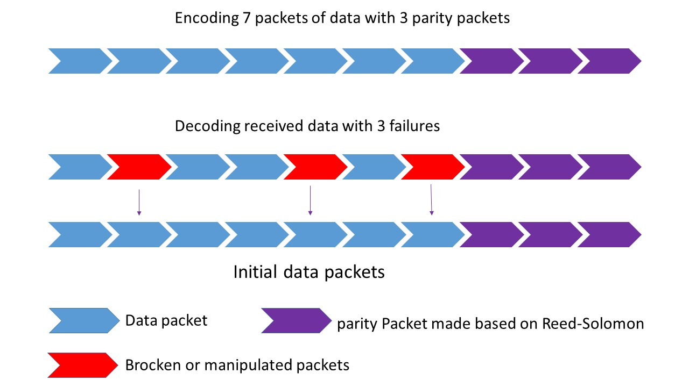

## 4 - Gulf Stream

Gulf stream is Solana’s mempool management solution. A mempool (i.e. memory pool) is a set of transactions which haven’t yet been processed in the blockchain and waiting to be picked up by network.

For instance you can take a look at bitcoin's mempool ( link is in the references section at the end of this tutorial. )

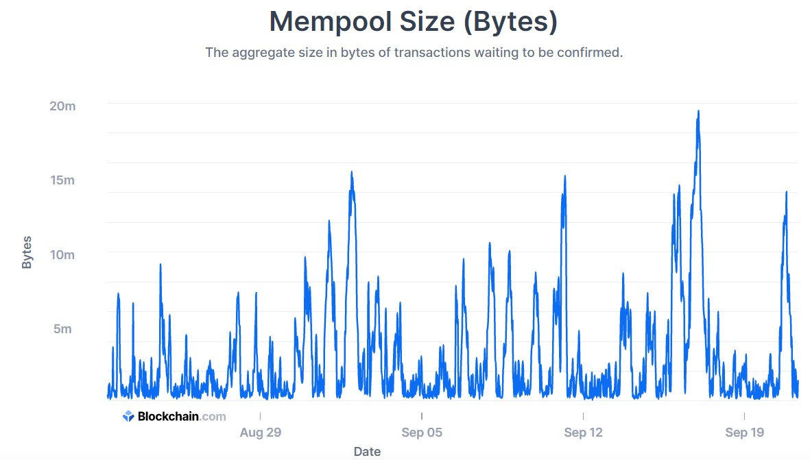

At the time I’m writing this tutorial (21 September 2021) the size of the mempool is 1.362M. which demonstrates the number of transactions in bytes waiting to be processed by bitcoin miners.
The size of a mempool depends on the supply and demand in block space. The more demand grows, the more transactions would be submitted and roughly with the same supply, mempool size grows.

With the rise of mempool size, the required time for processing a transaction rises as well on average and they say “blockchain gets slow”. The very naïve solution to this may be increasing the throughput of the network by scaling it and utilizing stronger hardware. But this needs a huge amount of resources to be spent and makes the network harder to manage and keep safe.

Solana has addressed this issue by using a technique they call Gulf Stream. Assuming Solana network’s throughput is 50,000 it can handle 100,000 sized mempool in a matter of seconds.

Each validator knows the order of upcoming leaders due to Solana's architecture. So client’s and validators forward transactions to upcoming leaders before they act as a leader in the network. This allows validators to start processing transactions ahead of time. This results in fewer transactions cashed in validators’ memory and faster confirmations. you can take a look at leader rotation and other details of Solana network at solanabeach (link in references).

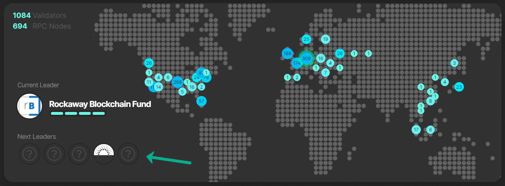

Leaders' rotation in the network ( Leader is a node which processes transactions and produces blocks ) 
source: solanabeach.io

Clients, such as wallets, sign transactions that reference a specific block-hash. Clients select a roughly recent block-hash that has been fully confirmed by the network. From the Tower BFT section, we know how a block gets confirmed and finalized in the network. It takes 2 slots or around ~800ms for a block to be proposed. As we have seen in the Tower BFT part of this tutorial proposed blocks either fail or get confirmed after 32 subsequent blocks.

Once a transaction is forwarded to any validator, the validator forwards that to one of the upcoming leaders. Once the network moves past the rollback point such that the referenced block-hash has expired, clients have a guarantee that the transaction is now invalid and will never be executed on-chain.

So that all being said what distinguishes Solana in terms of speed under heavy load of transactions ?!🤔 Utilizing the Gulf Stream results in 2 privileges for the Solana network.

1. Under load validators can process transactions ahead of time and discard any which fails.
2. A leader can prioritize executing transactions based on the position of the validator forwarded the transaction, in the network tree ( which means a transaction forwarded from a validator in layer #n is prior to another one forwarded from layer # n+1)

These two privileges together help the network to degrade and keep working even under a huge DoS attack.

## 5 - Archivers

When running with full capacity Solana will produce 1Gigabit per second. Just in 1024 seconds (~17 minutes) produced data would be 1Terrabit and in a year it would catch up to 4 Petabytes (32 Petabits). A tremendous amount of data to be stored!!!

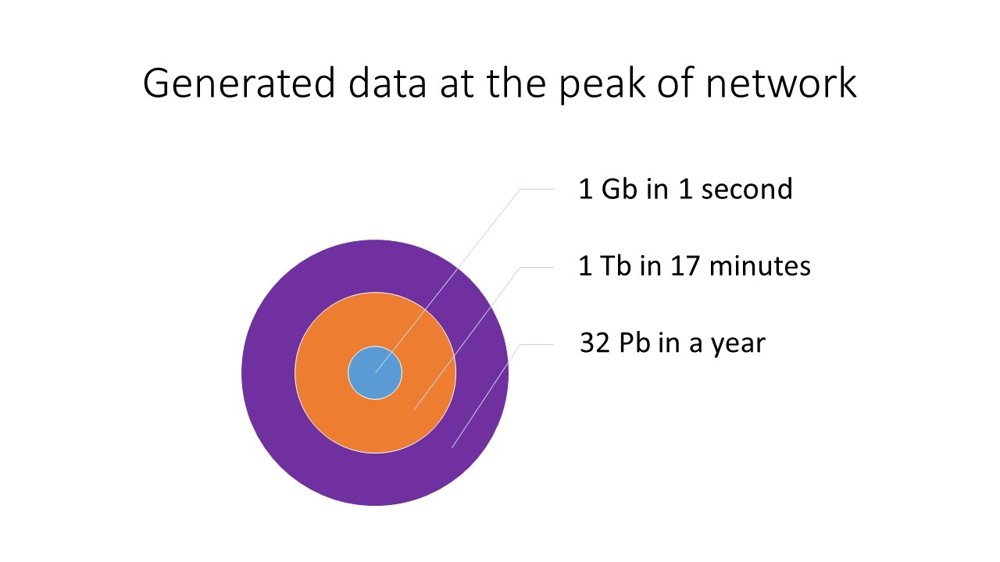

If each node in the network was required to store that much data, a limited group of participants who could afford and manage that kind of storage, could join the network and this makes the network centralized.

To avoid that and do it in the Solana way!, the Solana team built their version of PoRep. PoRep stands for proof of replication and it’s a system introduced by Filecoin initially in which a prover defends a publicly verifiable claim that it is dedicating unique resources to storing one or more retrievable replicas of a data file. Solana version of PoRep leverages the PoH technology to make validating proof of replication fast.

The nodes responsible for storing the ledger are archivers. They don’t participate in consensus and have lower hardware requirements than validators and leaders.
In an overview replicators work like below:


Archivers signal to the network that they have X bytes of space available for storing data. Frequently the network divides the ledger history into chunks to keep up sending ledger history to archivers with a replication rate. Then archivers download their respective data from the network. 

On some frequency, the network will ask/challenge the archivers to prove they’re doing their job of storing data and at this point, archivers should complete PoRep. To reward archivers they would get 3% of inflation for their efforts.

## 6 - Sea Level

Sealevel is Solana’s runtime for smart contracts. Running smart contracts in parallel and using all available computational resources of validators efficiently makes the Sealevel as one of the core innovations of Solana.

Sealevel is much more efficient and faster than single-threaded runtimes like EVM for the Ethereum or EOS-VM for the EOS. The reason for that is single-threaded runtimes can run one contract at a time but in Solana runtime, Sealevel, tens of thousands of transactions can be running in parallel using all available cores of the validator machine.


Solana transactions are composed of instructions. Each instruction contains the program ID it invokes, program instruction, and a list of accounts that the transaction needs to write or read. 

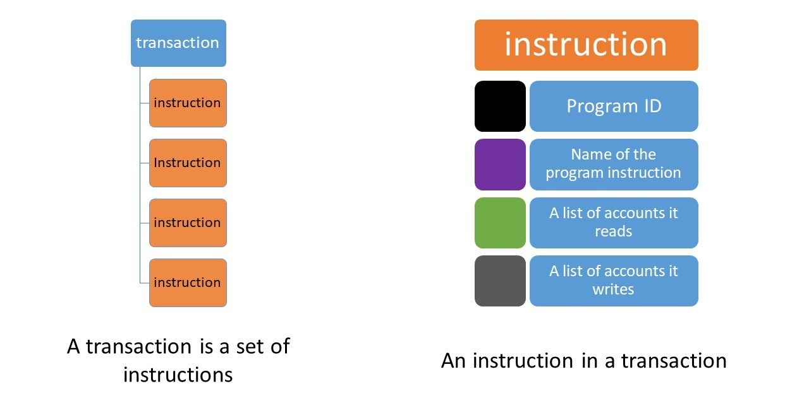

This enables Sealevel to sort and classify transactions so that those reading the same data from accounts or those which can be processed without overlapping (i.e. not overwriting the same state at the same time).

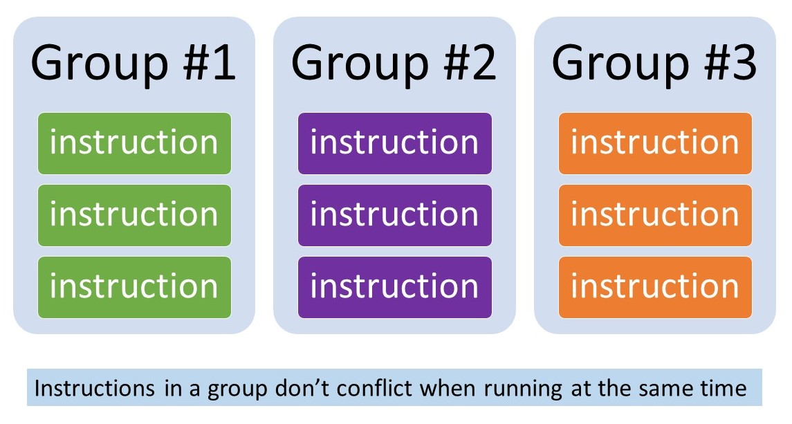

Each instruction tells the VM which accounts it wants to read and write ahead of time. So VM prefetches and prepares those data. This is the first optimization Sealevel does by organizing transactions. But the general optimization occurs at the hardware level.

Assume tons of transactions have been organized and classified into different groups. And the same instruction from a program (aka smart contract) is being invoked by 1000 different transactions. How we can take advantage of CPU and GPU architecture to run the instruction over these multiple data streams.

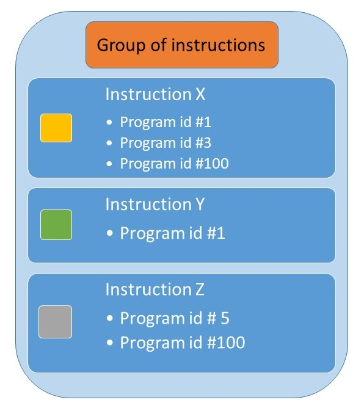

A SIMD CPU can run an instruction over multiple date sources so Sealevel does the next optimization by sorting all the instructions in a group by their program ID and then runs the program over all the data streams with all cores available in the CPU.


The same SIMD implementation exists in GPUs. And Solana nodes use GPUs. A modern Nvidia GPU has 4000 cores. And about 50 multiprocessors. A multiprocessor can execute only a single program instruction at a time but over 80 different inputs in parallel since it can use 4000 / 50 = 80 cores.

Now considering the previous step which Sealevel classified instructions by program ID, This GPU can run the program over all the data streams specified by instructions concurrently. For SIMD optimizations to be possible a trade-off on the structure of instructions is necessary. Instructions should be composed of a small number of branches should all take the same branch.

Sealevel does an impressive amount of optimization and again takes Solana one step further towards the best in comparison to other blockchains with single-threaded runtime like Etheruem.

## 7 - Pipelining

For processing a transaction an optimization system has been designed which enables the Validator of Leader node to keep working on incoming transactions without waiting for previous ones to be processed completely.

This technique is called pipelining and is common in systems with a stream of entries and consecutive processing steps. Imagine a kitchen in a popular restaurant. Since the restaurant has a constant flow of customers, the kitchen is always busy serving food for customers ASAP. The overall process of food preparation is like below.

- Washing and cleaning raw material
- cooking
- designing
- serving the food for costumer

This process is the same for all foods. Chefs in the kitchen have designed the system below to process as many orders as possible and keep all parts of the kitchen busy all the time.

A set of materials enters to washing section. Then washing sections works on it and passes the washed material to the cooking section. At the same time, the second set of raw materials enters to washing section.

Then the cooking section completes the cooking first set and passes it to the designing section and at the same time the third set of raw materials enters to washing section, and the second set of raw materials which is washed at the moment gets passed to the cooking section.

Then designing section after completing the designing, passes first set to serving section and so on ….

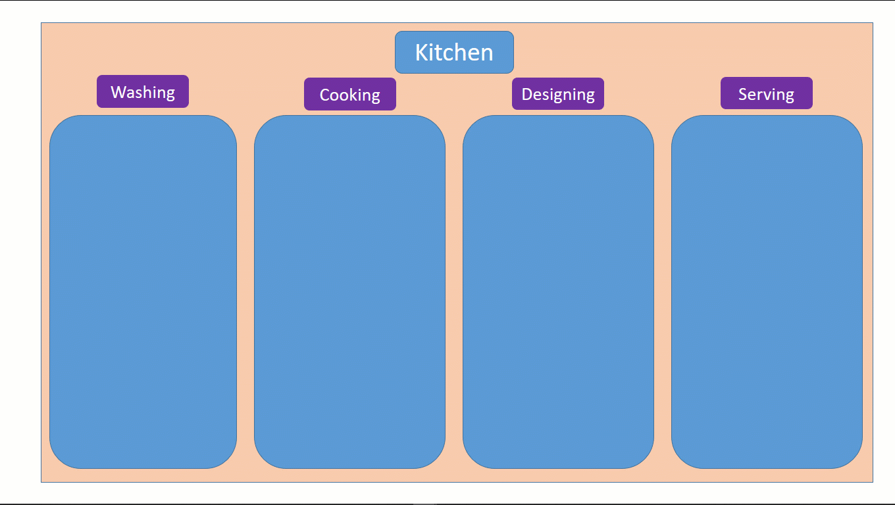

With this system orders constantly get processed by the kitchen and orders get served at a constant rate with the maximum delivery time of the slowest section of the kitchen.

The same paradigm has been implemented in Solana. Both Processing and validating a transaction consist of different stages. For a transaction to be processed by a leader node there are four steps:

- fetching
- signature verifying
- banking
- Broadcasting

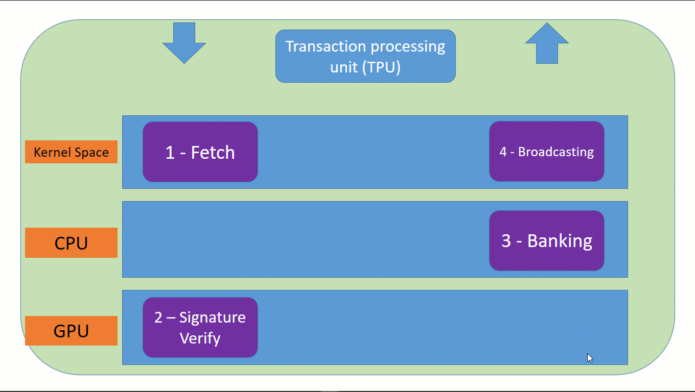

transactions getting processed simultaneously

To process a transaction fast, each stage of it gets handled by a different processing unit. Kernel Space handles Fetching and Broadcasting. CPU handles banking and GPU handles signature verification.
In the kitchen example, cooking may be the slowest step and in transaction processing, the signature verifying requires the most computation and time. That's why Signature verification is handled by GPU. 

A node in the Solana network runs two pipelined processes, a transaction processing unit (TPU) when it acts as a leader and a transaction validation unit (TVU) when it acts as a validator. The hardware being used for processes and network input and output is the same but the process happening in each pipeline is different.

## 8 - Cloud Break

Some blockchains like Ethereum use the technique of sharding to scale the network. which means blockchain's database gets splitted and this way the load of transactions gets spreaded over these smaller chains.

Cloud Break is a data structure that made it possible to read from and write on the database simultaneously. it uses memory-mapped files and can handle concurrent reads and writes between 32 threads which modern SSD supports.

# Conclusion

Solana is a revolutionary blockchain with fundamental innovations expressed above. It has all it takes to be an outstanding Blockchain.

That's not just my idea! A lot of developers have built a variety of projects and apps on Solana. Serum Dex, Audius, Metaplex, and chainlink are just a few to name. You can find much more details and apps in the ecosystem section of the Solana website. (link provided at the end of tutorial, references)


a classified version of Solana ecosystem. source: [@solanians_](https://twitter.com/solanians_)

as my final words I want to say "SOLANA IS THE FUTURE". thanks for reading my article and I hope it shed some light on parts you may had difficulty to understand.

# About The Author

I'm Mahdi Mostafavi a web developer and I'm learning about Solana so that I can build an amazing project on it which I have in my head. 

my GitHub: [github.com/mmostafavi](https://github.com/mmostafavi)

in case you found any misinformation in the article or had any suggestions to improve the article please comment it or you can find me on Twitter: [@mahdi_ftp](http://twitter.com/mahdi_ftp). 

# **References**

bitcoin mempool : [https://www.blockchain.com/charts/mempool-size](https://www.blockchain.com/charts/mempool-size)

solanabeach website : [https://solanabeach.io](https://solanabeach.io)

An overview to solana ecosystem on official website: [https://solana.com/ecosystem](https://solana.com/ecosystem)

Solanians's Twitter :  [https://twitter.com/solanians_](https://twitter.com/solanians_)
