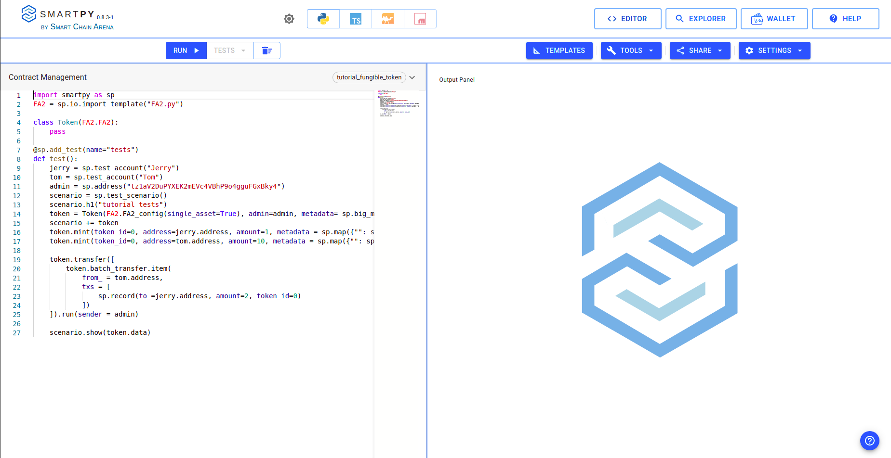
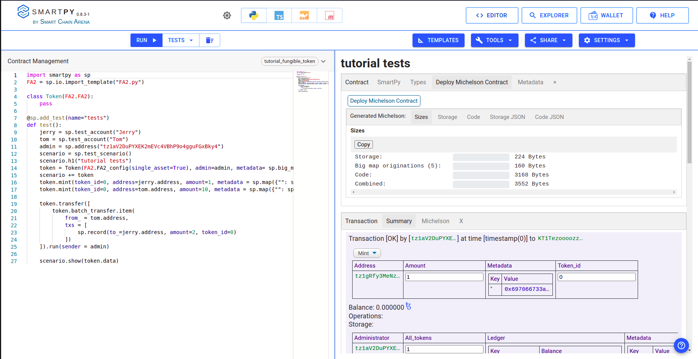
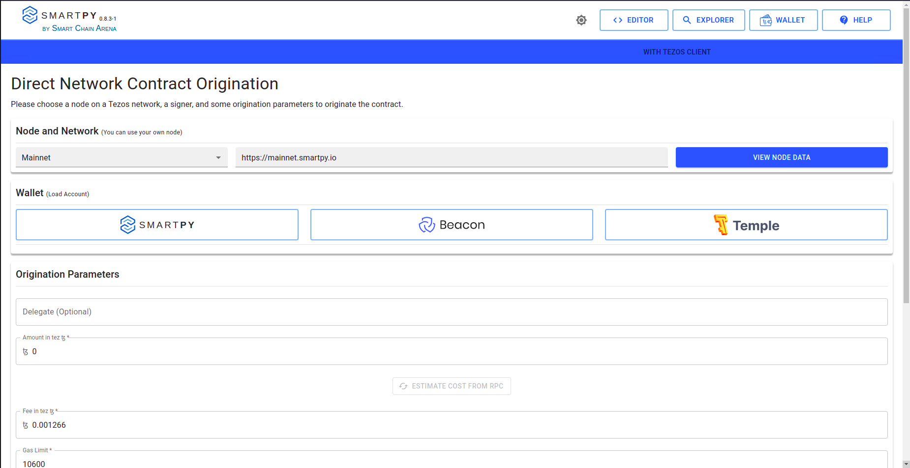
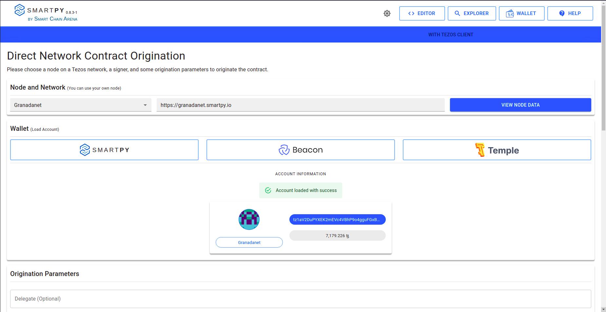
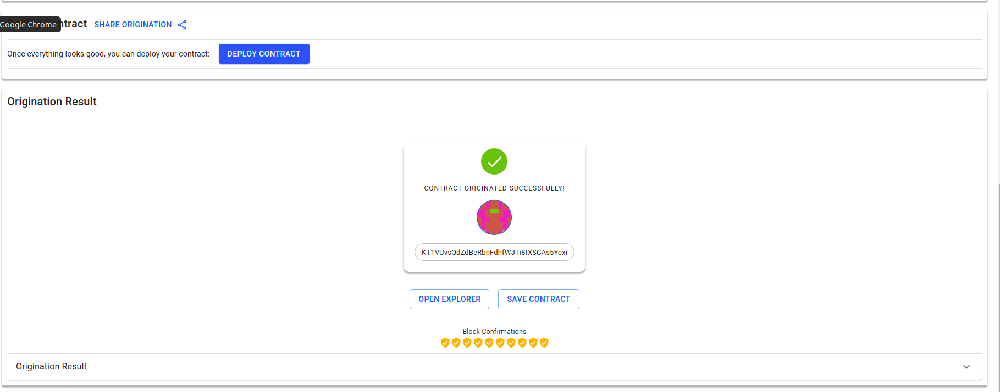
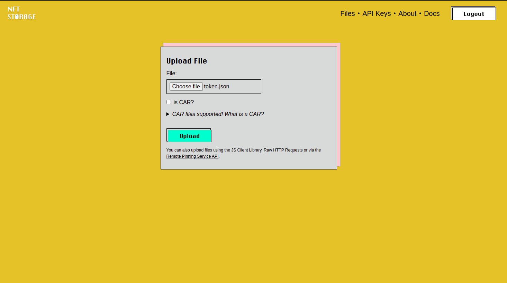
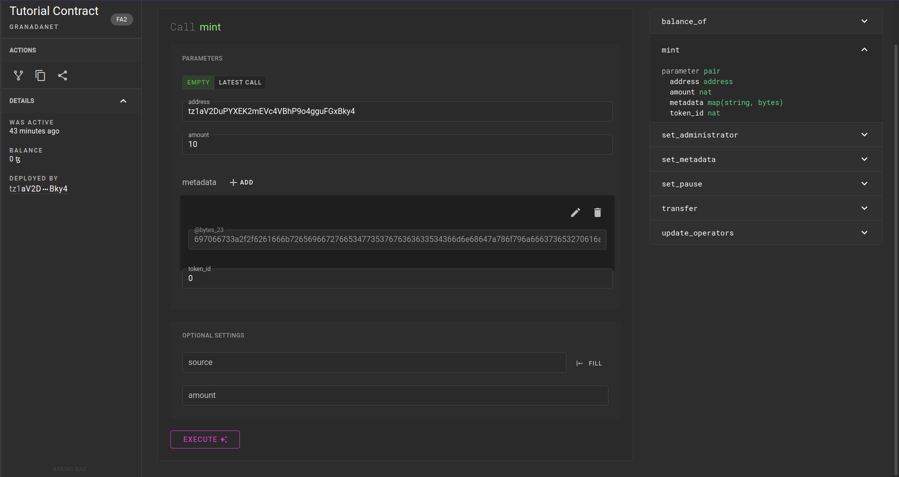
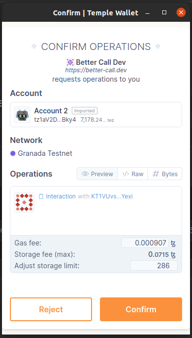
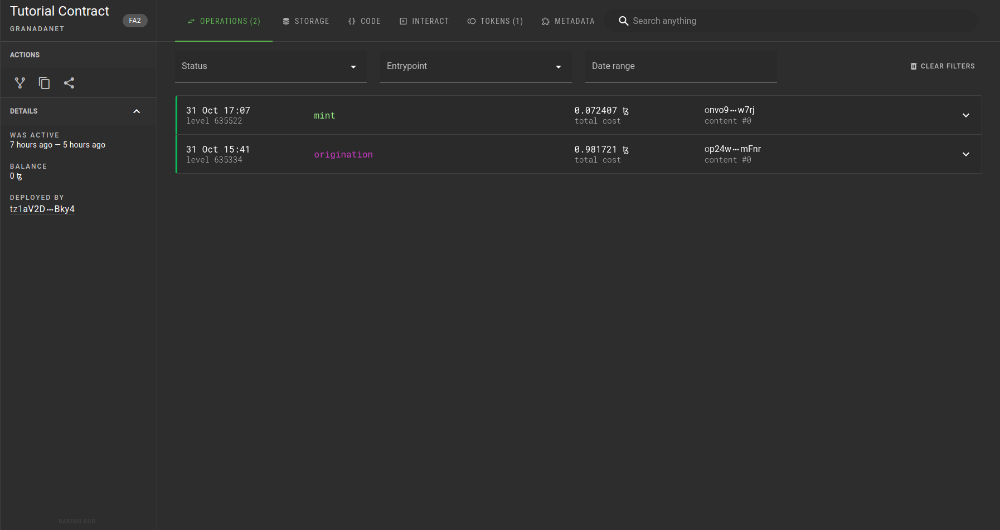
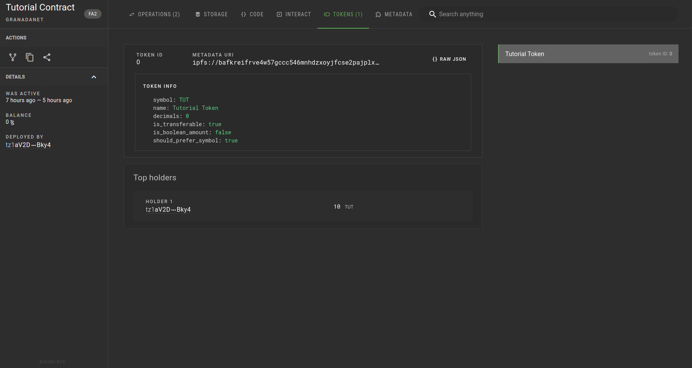

# Introduction

Hi! Welcome to this tutorial on how to mint Fungible Token on Tezos. In this tutorial, we will write a smart contract in SmartPy and deploy it on granadanet, upload the token metadata on IPFS and mint the token using better-call.dev. We will also cover how to mint tokens using React and taquito.

# Prerequisites

- Basic Knowledge of SmartPy
- React

# Requirements

- Temple Wallet Installed in your browser. Get it from https://templewallet.com/
- Few XTZs on Granada Testnet is also needed in the wallet account. To get it, you can refer to Faucet and Temple Wallet section in this [tutorial](https://learn.figment.io/tutorials/using-the-smartpy-ide-to-deploy-tezos-smart-contracts#faucet-and-temple-wallet).
- NodeJS, npm and git needs to be installed for the frontend.

# SmartPy

SmartPy is an intuitive and powerful smart contract development platform for Tezos.  
The SmartPy language is available through a Python library for building and analyzing Tezos smart contracts.  
And with its IDE, we can quickly write our code in the browser itself. We can also deploy our code from the browser. No local setup is required.  
So, Let's start. Open https://smartpy.io/ide


You can explore and look at the template codes given.  
To move to the editor, click CLOSE.

# Token Contract and FA2 Standard

The left panel is where we are going to code.  
We are going to follow the FA2 token standard([TZIP-12](https://tzip.tezosagora.org/proposal/tzip-12/)) for our token.  
Let’s start coding our contract.

First, we will import the smartpy library.

```python
import smartpy as sp
```

Now we will import the FA2 template. Most of the features (mint, transfer) we need have already been implemented in this template.

```python
FA2 = sp.io.import_template("FA2.py")
```

Let’s use this template and inherit it in our Token class, and the entry points we need for this tutorial are already in the template, so we don’t need to change our class and simply pass. And this will be our contract.

```python
class Token(FA2.FA2):
    pass
```

Let’s write some tests for our contract.

We need some test accounts for tests; let's add two test accounts, Tom and Jerry. And as we also need to set admin for our contract, we require that also. For admin also, you can use a test account and set your address as admin later from storage JSON while deploying, but I prefer putting it in tests itself.

```python
@sp.add_test(name="tests")
def test():
    jerry = sp.test_account("Jerry")
    tom = sp.test_account("Tom")
    admin = sp.address("tz1aV2DuPYXEK2mEVc4VBhP9o4gguFGxBky4")
```

Change the address inside the sp.address to your address (your wallet account public key).

For tests, we need to create test_scenario and assign a heading to it using h1.

```python
    scenario = sp.test_scenario()
    scenario.h1("tutorial tests")
```

Now we will originate our Tokens contract. As we inherit the FA2 template, we need to understand what parameters we need to send and can change that according to our needs.  
To our contract we need to send config, admin and metadata.   
The FA2 template provides us with FA2_config which we will be using for the config to control the token behaviour. There are multiple options ,but the ones we need are single_asset and non_fungible. As we want our token to be fungible, we will set non_fungible to False. And for this tutorial, we want the token to be of only one type and for that we will set single_asset to True.  
The default value of non_fungible is False in the config, so we don't need to change it, but the default value of single_asset is False ,so we will set that to True in the config.  
For the admin, we pass the admin address we created.  
For metadata, we will use big_map, in which first we set where to look for the metadata. Here from tezos-storage:content we can understand we need to look for content in the storage. And in storage, we will define the metadata. We will define the name and description.  
You can refer to [TZIP-16](https://tzip.tezosagora.org/proposal/tzip-16/) for more details on contract metadata.

```python
    token = Token(FA2.FA2_config(single_asset=True), admin=admin, metadata= sp.big_map({"": sp.utils.bytes_of_string("tezos-storage:content"),"content": sp.utils.bytes_of_string("""{"name": "Tutorial Contract", "description": "Fungible Token contract for the tutorial"}""")}))
```

Add the token to scenario.

```python
    scenario += token
```

Test the mint entry point.  
We send three parameters to the mint entry point.

- token_id  
  the token id must always be 0 as single_asset.

- address  
  the address on which we want to mint the token.

- metadata  
  for token metadata, we are using IPFS (will come to it later in this tutorial).  
  The metadata is stored in a map(string, bytes) so, we need to convert the strings to IPFS for which sp.utils.bytes_of_string is used.  
  For now, use the same IPFS URL (ipfs://bafkreifrve4w57gccc546mnhdzxoyjfcse2pajplxsqe5u3fjnclaakloi)

Here, we are minting one token on jerry and ten tokens on tom address. And remember, only the admin can run the mint query.

```python
    token.mint(token_id=0, address=jerry.address, amount=1, metadata = sp.map({"": sp.utils.bytes_of_string("ipfs://bafkreifrve4w57gccc546mnhdzxoyjfcse2pajplxsqe5u3fjnclaakloi")})).run(sender=admin)
    token.mint(token_id=0, address=tom.address, amount=10, metadata = sp.map({"": sp.utils.bytes_of_string("ipfs://bafkreifrve4w57gccc546mnhdzxoyjfcse2pajplxsqe5u3fjnclaakloi")})).run(sender=admin)
```

Let's test the transfer entry point also.   
For transfer, we will be using the batchtransfer helper defined in the FA2 standard. It will take the from_ and txs arguments. txs is the array of transactions which contains the to\_ , amount and token_id.  
Here, we are sending 2 token from tom to jerry.

```python
    token.transfer([
        token.batch_transfer.item(
            from_ = tom.address,
            txs = [
                sp.record(to_=jerry.address, amount=2, token_id=0)
            ])
    ]).run(sender = admin)
```

For checking, output the data stored in token storage also.

```python
    scenario.show(token.data)
```

This is our contract.  
Here's the full code you can refer to:

```python
import smartpy as sp
FA2 = sp.io.import_template("FA2.py")

class Token(FA2.FA2):
    pass

@sp.add_test(name="tests")
def test():
    jerry = sp.test_account("Jerry")
    tom = sp.test_account("Tom")
    admin = sp.address("tz1aV2DuPYXEK2mEVc4VBhP9o4gguFGxBky4")
    scenario = sp.test_scenario()
    scenario.h1("tutorial tests")
    token = Token(FA2.FA2_config(single_asset=True), admin=admin, metadata= sp.big_map({"": sp.utils.bytes_of_string("tezos-storage:content"),"content": sp.utils.bytes_of_string("""{"name": "Tutorial Contract", "description": "Fungible Token contract for the tutorial"}""")}))
    scenario += token
    token.mint(token_id=0, address=jerry.address, amount=1, metadata = sp.map({"": sp.utils.bytes_of_string("ipfs://bafkreifrve4w57gccc546mnhdzxoyjfcse2pajplxsqe5u3fjnclaakloi")})).run(sender=admin)
    token.mint(token_id=0, address=tom.address, amount=10, metadata = sp.map({"": sp.utils.bytes_of_string("ipfs://bafkreifrve4w57gccc546mnhdzxoyjfcse2pajplxsqe5u3fjnclaakloi")})).run(sender=admin)

    token.transfer([
        token.batch_transfer.item(
            from_ = tom.address,
            txs = [
                sp.record(to_=jerry.address, amount=2, token_id=0)
            ])
    ]).run(sender = admin)

    scenario.show(token.data)
```

Run the code using the RUN button above the left(editor) panel or can use ctrl+enter also, cmd+enter for mac.



If there are no errors, we will get the output in the right terminal.  
We can check it according to the tests defined. We defined the heading in h1 in tests as “tutorial tests”, so we can see that on the top. Then, we minted one token on jerry address and ten tokens on tom address; we can see that. After that, there's transfer in which it's transferring two tokens from tom to jerry. So this looks perfect, and our contract is working correctly.


In the end, there is contract storage also and we can check in that there are eigth tokens in tom's address and three tokens in jerry's address and it's correct according to our tests.


# Deploy Contract

It’s time to deploy this contract. For this tutorial, we are going to deploy the contract on Granada testnet.  
We can deploy the contract using smartpy IDE itself.
After running, we get the option to Deploy Michelson Contract in the output panel. Move to it.

Click on the Deploy Michelson Contract button.



A new tab will open up.



Choose Granadanet in the Node. Now Click on Temple Wallet. Choose one account (if you have multiple). And then press connect.

Account loaded with success will come.


Scroll down below and click on Estimate Cost From RPC. It will refresh the cost. And after that, click on the DEPLOY CONTRACT button.


Accept the pre-signature information.

Then your wallet popup will come. Press sign.

Contract Originated Successfully will be shown. Copy the contract address(KT1VUvsQdZdBeRbnFdhfWJTi8tXSCAs5Yexi) and store it.



Hurray, we deployed our contract successfully.

# IPFS

IPFS is a distributed system for storing and accessing files, websites, applications, and data.  
And, we will use IPFS to store the metadata of our tokens. And to upload our files to IPFS, we will use nft.storage.    
In this tutorial, we will upload the token metadata in JSON format to IPFS.

For token metadata, decimals is the required field according to the FA2 standard. name and symbol fields are highly recommended.
There are other fields also which can be used. You can read the details of all this in the [TZIP-21](https://tzip.tezosagora.org/proposal/tzip-21/).  
We will be storing the metadata in a JSON file. Create `token.json` and open it in any editor of your choice.

```json
{
  "name": "Tutorial Token",
  "symbol": "TUT",
  "decimals": 0,
  "shouldPreferSymbol": true
}
```

Edit the name, symbol, decimals and shouldPreferSymbol according to the need. If shouldPreferSymbol is set to true symbol is preferred over name in indexers, wallets.

So to upload files, visit [nft.storage](https://nft.storage/).


Log in and click on upload and choose the `token.json` and upload.



Upload it now.  
The file will get uploaded, and this is your hash.


You can view your files visiting ipfs://{hash} (If your browser doesn’t support IPFS, you can use https://ipfs.io/ipfs/{hash} )

# Mint using better-call.dev

It's time to mint our token. Open up [better-call.dev](https://better-call.dev/).

Move to interact tab, open mint from the right sidebar.  
Put the amount and address you want to mint the token to. The token_id should be 0 as our contract is single_asset. And for metadata, we will take the hash of the `token.json` file we uploaded above and use ipfs://{hash} to set the token metadata. But for the token metadata, the ipfs URL needs to be in bytes. You can convert the strings to bytes from [here](https://tutorial-mint-nfts.vercel.app/char2bytes).


Press Execute and choose the wallet option. From the list of wallets, choose the temple wallet. And then use the account which was set to admin for the contract. This is important; we won’t be able to mint using any other address. Only admin can mint according to our smart contract.



You can check the fees and also explore the operations which wallet is going to send. Then click confirm.



The message will come if it’s successfully sent.


After few seconds, refresh and move to the operations tab, you can see the mint operation.



You can look at the metdata of the token in the tokens section.



Hurray, we minted our token.

# Frontend

Import this boilerplate code using the following command.

```text
git clone -b boilerplate --single-branch https://github.com/PriyanshuDangi/Tutorial_Fungible_Tokens.git
```

cd into the folder

```text
cd Tutorial_Fungible_Tokens
```

Install all the dependencies

```text
npm i
```

Try running the app using

```text
npm start
```

And visit localhost:3000 to view the app. There won't be much as of now. So let's build it.

The boilerplate has a folder structure and two pages.

- Mint (Form to mint the Tokens)
- Transfer (Form to transfer tokens)

Open `src/config/config.js`. This is where we store our configurations.

```js
export const NAME = 'Tutorial'; // the name of the app
export const CONTRACT_ADDRESS = 'KT1VUvsQdZdBeRbnFdhfWJTi8tXSCAs5Yexi';
export const RPC_URL = 'https://granadanet.smartpy.io'; // network rpc url
export const NETWORK = 'granadanet';
```

Change the name and contract address accordingly, and as we deployed to Granada Testnet, we are using that network. If deployed on any other network, it can be changed accordingly.

Let’s import the TezosToolkit and beacon SDK, which we will use to connect to the wallet.
We also need to import our config object and char2Bytes from the Taquito utils.

```js
import {TezosToolkit, MichelsonMap} from '@taquito/taquito';
import {BeaconWallet} from '@taquito/beacon-wallet';
import * as config from '../config/config';
import {char2Bytes} from '@taquito/utils';
```

Next, we will be configuring the beacon wallet options and setting the wallet provider.

```js
const Tezos = new TezosToolkit(config.RPC_URL);

const options = {
  name: config.NAME,
  iconUrl: 'https://tezostaquito.io/img/favicon.png',
  preferredNetwork: config.NETWORK,
};

const wallet = new BeaconWallet(options);

Tezos.setWalletProvider(wallet);
```

Next, we will write functions to connect the wallet (requesting the user permission) and disconnect the wallet.

```js
const connectWallet = async () => {
  await wallet.requestPermissions({
    network: {
      type: config.NETWORK,
    },
  });
  return wallet;
};

const disconnectWallet = async () => {
  await wallet.clearActiveAccount();
};
```

To get the user's Public Key Hash (pkh) and get the contract, use the following functions.

```js
const getPKH = async () => {
  const pkh = await wallet.getPKH();
  return pkh;
};

const getContract = async () => {
  const contract = await Tezos.wallet.at(config.CONTRACT_ADDRESS);
  return contract;
};
```

Now to mint tokens, we need the user to connect his wallet and then sign the mint method. Use the IPFS url of the `token.json` we uploaded above.

```js
const mint = async (address, amount) => {
  await disconnectWallet();
  await connectWallet();
  const token_id = 0;
  let url = 'ipfs://bafkreifrve4w57gccc546mnhdzxoyjfcse2pajplxsqe5u3fjnclaakloi';
  const contract = await getContract();
  url = char2Bytes(url);
  const op = await contract.methods.mint(address, amount, MichelsonMap.fromLiteral({'': url}), token_id).send();
  return await op.confirmation(3);
};
```

For transfer also, we need the user to connect his wallet and sign the transfer method.

```js
const transfer = async (address, transactions) => {
  await disconnectWallet();
  await connectWallet();
  const token_id = 0;
  const txs = transactions.map((transaction) => {
    return {
      to_: transaction.to,
      amount: transaction.amount,
      token_id: token_id,
    };
  });
  const contract = await getContract();
  const op = await contract.methods
    .transfer([
      {
        from_: address,
        txs: txs,
      },
    ])
    .send();
  return await op.confirmation(3);
};
```

And we are exporting mint and transfer functions from the file at the end.

```js
export {mint, transfer};
```

This was our `src/utils/wallet.js`.

As we are done with the utils now, we can code the pages to use these utils.

Let's start with our `src/components/mint/Mint.jsx` (remove the already present code).  
Let's import React, useState and our mint util first.

```jsx
import React, {useState} from 'react';

import {mint} from '../../utils/wallet';
```

Now we will set the state.

```jsx
const Mint = () => {
  const [loading, setLoading] = useState(false);
  const [message, setMessage] = useState('');
```

In our submit function, we take the address, amount from the input fields and then we call the mint util.

```jsx
const submit = async (event) => {
  try {
    event.preventDefault();
    setLoading(true);
    const address = event.target.address.value;
    const amount = event.target.amount.value;

    const op = await mint(address, amount);

    console.log(op);
    setMessage('Minted Successfully!');

    setLoading(false);
  } catch (err) {
    console.log(err);
    setLoading(false);
    setMessage('Error: Not Able to Mint');
  }
};
```

To close the toast, we set the message to empty.

```jsx
const closeMessage = () => {
  setMessage('');
};
```

This is our page code.

```jsx
return (
  <div className="container">
    {message && (
      <div className="position-fixed top-0 end-0 p-3" style={{zIndex: 11}}>
        <div id="liveToast" className="toast fade show d-flex" role="alert" aria-live="assertive" aria-atomic="true">
          <div className="toast-body">{message}</div>
          <button type="button" className="btn-close me-2 m-auto" onClick={closeMessage}></button>
        </div>
      </div>
    )}
    <form onSubmit={submit}>
      <div className="mb-3">
        <label htmlFor="address" className="form-label">
          Address
        </label>
        <input type="text" className="form-control" id="address" aria-describedby="address" required />
      </div>
      <div className="mb-3">
        <label htmlFor="amount" className="form-label">
          Amount
        </label>
        <input type="number" className="form-control" id="amount" aria-describedby="amount" required min="1" step="1" />
      </div>
      <button type="submit" className="btn btn-primary" disabled={loading}>
        {loading && <span className="spinner-border spinner-border-sm" role="status" aria-hidden="true"></span>}
        Mint
      </button>
    </form>
  </div>
);
```

And in the end, we close the Mint function and default export it.

```jsx
};

export default Mint;
```

Time for `src/components/transfer/Transfer.jsx` (remove the already present code). It will be mostly the same as Mint page with just slight changes.  
Let's import React, useState and our transfer util first.

```jsx
import React, {useState} from 'react';

import {transfer} from '../../utils/wallet';
```

Now we will set the state.

```jsx
const Transfer = () => {
  const [loading, setLoading] = useState(false);
  const [message, setMessage] = useState('');
```

In our submit function, we take the address, amount, to from the input fields and then we call the transer util. Here we are only trasfering to one account, but more transfers can be added by adding it in the transactions array.

```jsx
const submit = async (event) => {
  try {
    event.preventDefault();
    setLoading(true);
    const address = event.target.address.value;
    const to = event.target.to.value;
    const amount = event.target.amount.value;

    const transactions = [
      {
        to,
        amount,
      },
    ];

    const op = await transfer(address, transactions);

    console.log(op);
    setMessage('Transfered Successfully!');

    setLoading(false);
  } catch (err) {
    console.log(err);
    setLoading(false);
    setMessage('Error: Not Able to Transfer');
  }
};
```

Same as in Mint, to close the toast, we set the message to empty.

```jsx
const closeMessage = () => {
  setMessage('');
};
```

This is our page code.

```jsx
return (
  <div className="container">
    {message && (
      <div className="position-fixed top-0 end-0 p-3" style={{zIndex: 11}}>
        <div id="liveToast" className="toast fade show d-flex" role="alert" aria-live="assertive" aria-atomic="true">
          <div className="toast-body">{message}</div>
          <button type="button" className="btn-close me-2 m-auto" onClick={closeMessage}></button>
        </div>
      </div>
    )}
    <form onSubmit={submit}>
      <div className="mb-3">
        <label htmlFor="address" className="form-label">
          From
        </label>
        <input type="text" className="form-control" id="address" aria-describedby="address" required />
      </div>
      <div>
        <div className="mb-3">
          <div className="mb-3">
            <label htmlFor="to" className="form-label">
              To
            </label>
            <input type="text" className="form-control" id="to" aria-describedby="to" required />
          </div>
          <label htmlFor="amount" className="form-label">
            Amount
          </label>
          <input
            type="number"
            className="form-control"
            id="amount"
            aria-describedby="amount"
            required
            min="1"
            step="1"
          />
        </div>
      </div>
      <button type="submit" className="btn btn-primary" disabled={loading}>
        {loading && <span className="spinner-border spinner-border-sm" role="status" aria-hidden="true"></span>}
        Transfer
      </button>
    </form>
  </div>
);
```

And in the end, we close the Transfer function and default export it.

```jsx
};

export default Transfer;
```

Now run in terminal

```text
npm start
```

Open locahost:3000 in browser and mint a token on `/` and transfer them on `/transfer`.

We completed the frontend. You can checkout the complete code on [Github](https://github.com/PriyanshuDangi/Tutorial_Fungible_Tokens).

# Conclusion

In this tutorial, we learned about coding in SmartPy, deploying a contract on the blockchain, and interacting with the contract using better-call.dev. We also built the frontend using React and learned how to interact using taquito.

And most importantly, we learned how to mint and transfer fungible tokens on Tezos.

# About The Author

This tutorial was written by Priyanshu Dangi, who is a Tezos India 2.0 Fellow. You can reach out to him on [Github](https://github.com/PriyanshuDangi).
