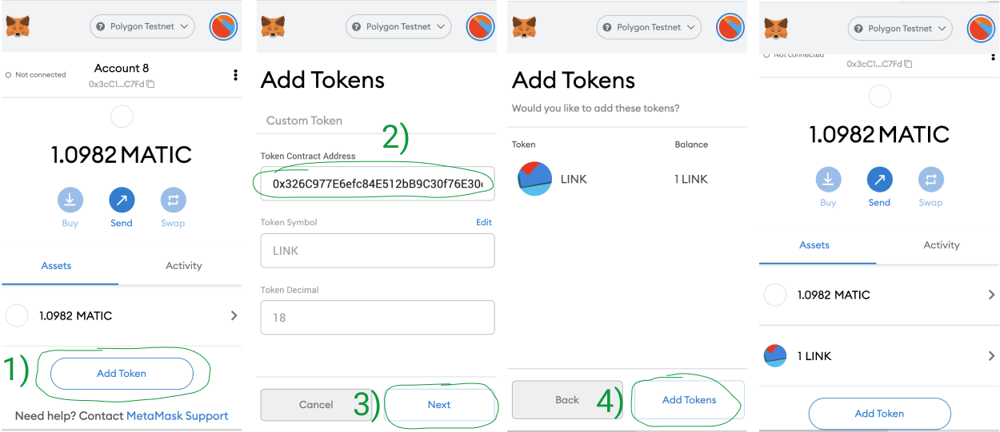
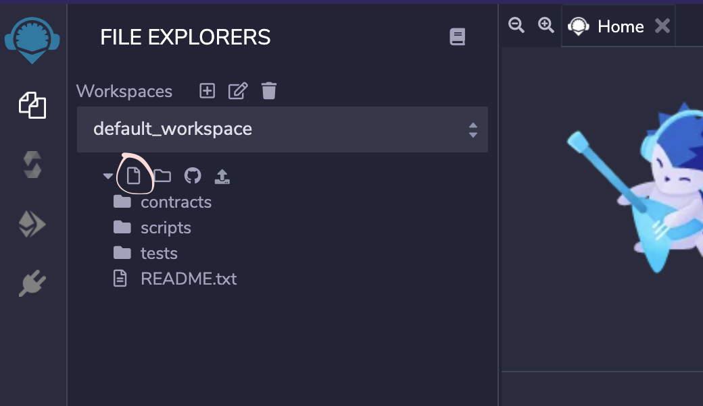
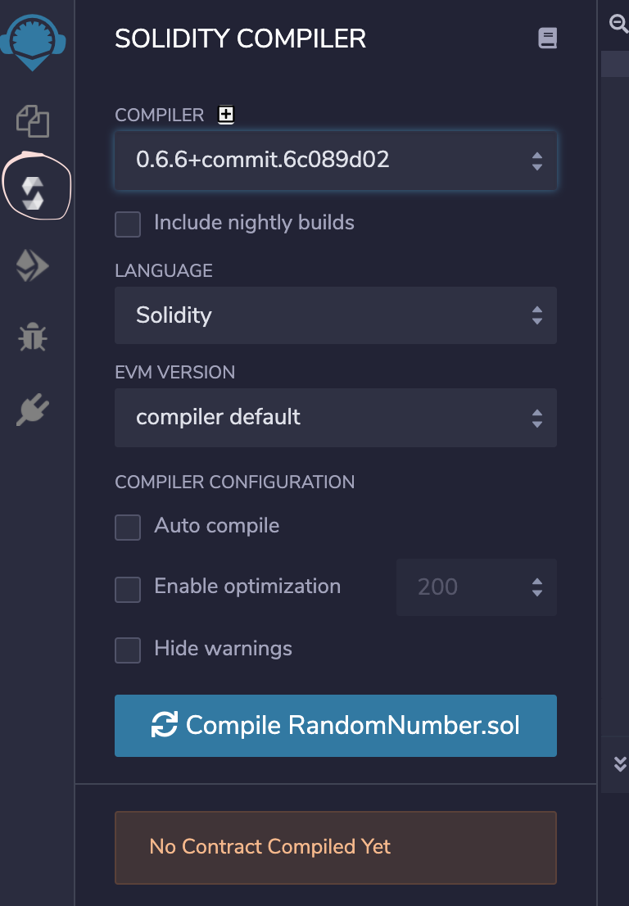
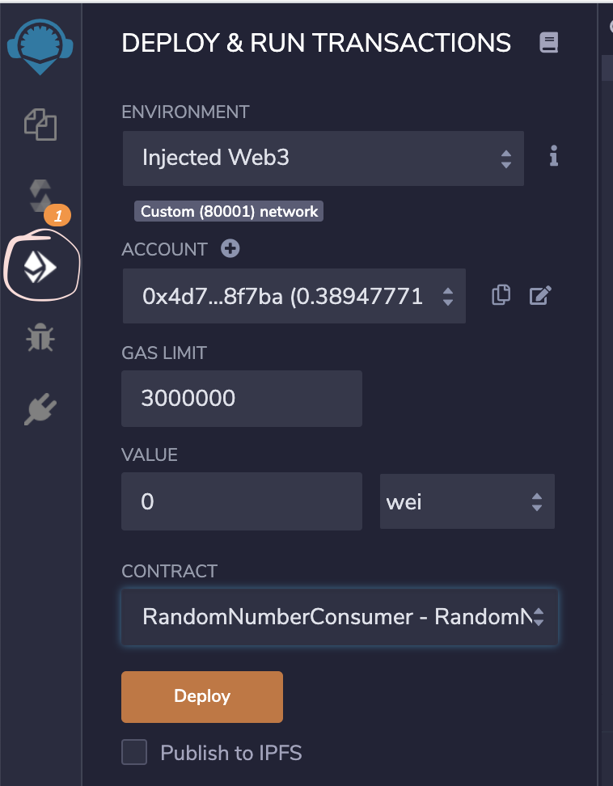
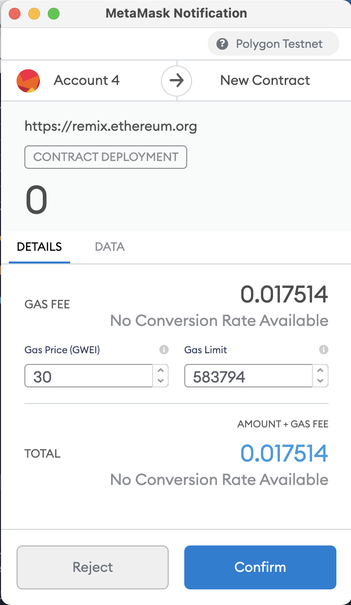
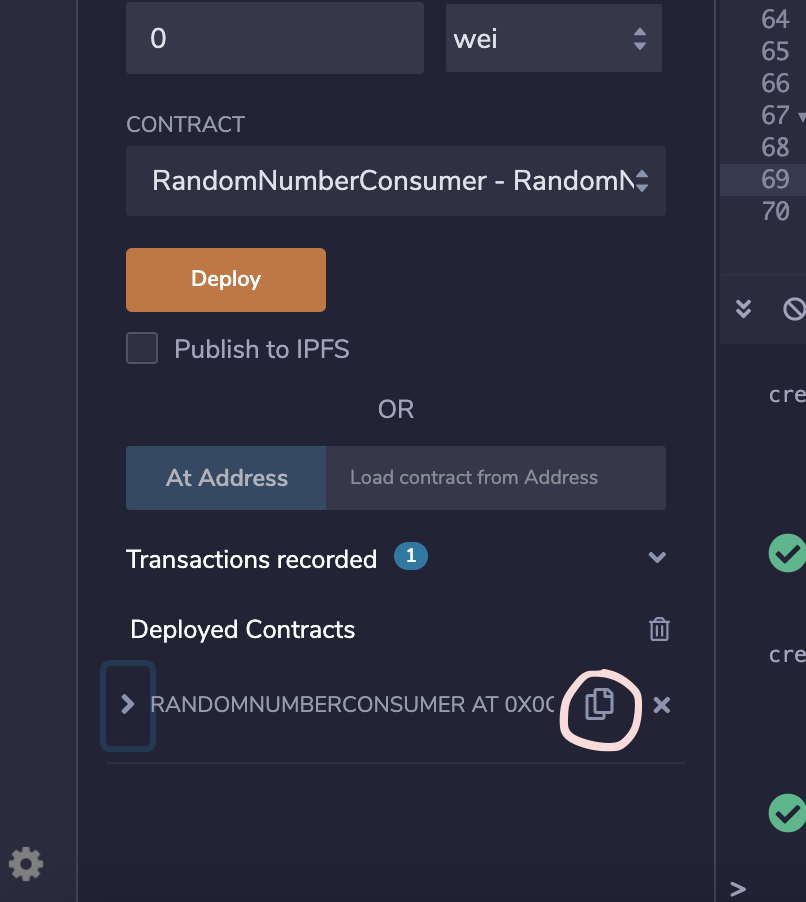
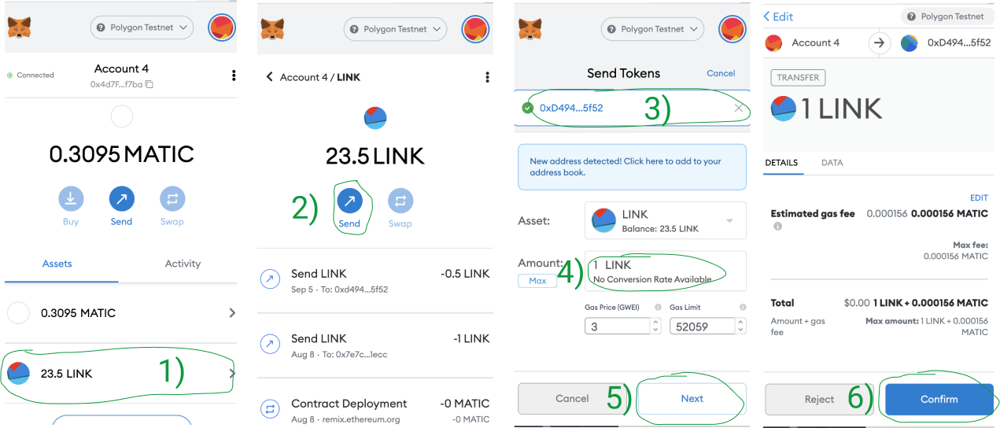
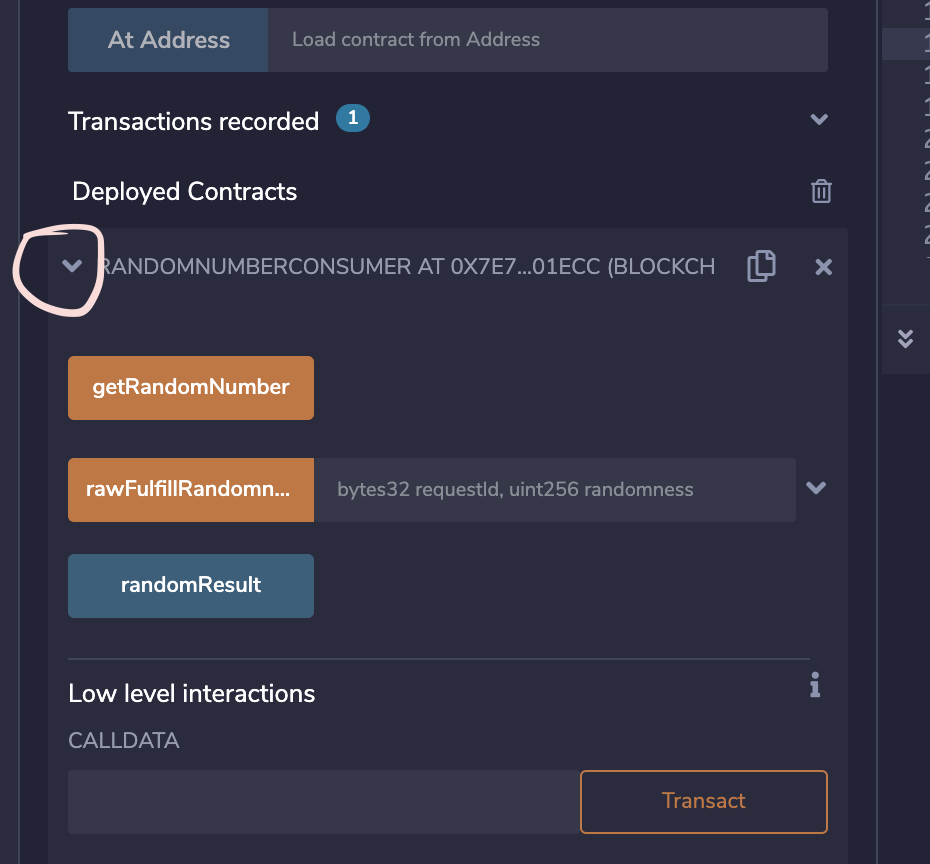
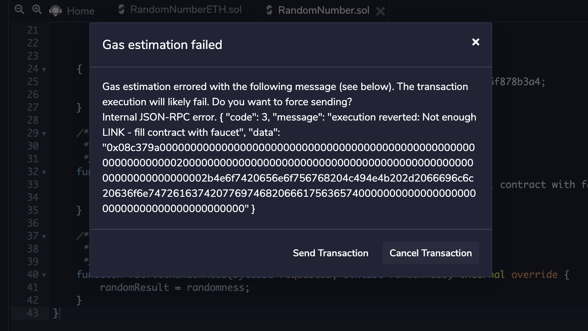

# Introduction
This tutorial will introduce you to generating random numbers in Solidity smart contracts using Chainlink VRF ([Verifiable Random Function](https://docs.chain.link/docs/chainlink-vrf/#generate-random-numbers-in-your-smart-contracts)). Chainlink VRF is used as a verifiable source of randomness on-chain. We will be using the Polygon (Matic) Mumbai testnet and the Remix IDE.

# Why use Chainlink VRF?
Solidity contracts are deterministic, therefore anyone who figures out how your contract produces randomness could predict its results. Chainlink VRF generates a random number off-chain with a cryptographic proof used to verify the result.

# Prerequisites
To follow this tutorial, you should have a basic understanding of Solidity [smart contracts](https://solidity-by-example.org/) & the [Remix IDE](https://remix.ethereum.org/). You should also complete the [Polygon (Matic) Pathway](https://learn.figment.io/network-documentation/matic/polygon-matic-pathway).

# Requirements
* You will need to have the [MetaMask](https://metamask.io) browser extension installed.

# Using Chainlink VRF 

## Getting testnet tokens
You will need some testnet MATIC and LINK. These can be acquired from the [Polygon Faucet](https://faucet.polygon.technology/). MATIC token will be used to pay for contract deployment and making transactions. LINK token will be used to pay the Chainlink oracle for randomness.

Open your Metamask and change the active network to Polygon (Matic) Mumbai testnet and copy your wallet address by clicking on it in the Metamask window. If you do not have the Mumbai testnet set up in your Metamask, read the article [Configure Polygon on Metamask](https://docs.matic.network/docs/develop/metamask/config-polygon-on-metamask). Make sure you select the Mumbai Testnet tab to see the configuration details.

Go to the [Polygon Faucet](https://faucet.polygon.technology/) to get some MATIC and LINK testnet tokens by pasting your wallet address and clicking on "Submit".

You can go to this URL [https://mumbai.polygonscan.com/](https://mumbai.polygonscan.com/) to check your balances by entering your address on the search bar.

You can view your current MATIC and LINK balances in Metamask or by going to [https://mumbai.polygonscan.com/](https://mumbai.polygonscan.com/) & entering your address in the search bar.

To see LINK tokens in your Metamask:
1) Click on the Add Token button
2) Enter `0x326C977E6efc84E512bB9C30f76E30c160eD06FB` in the Token Contract Address text field. Token Symbol and Token Decimal text fields will be pre-filled when you enter the Token Contract Address.
3) Click the Next button
4) Click the Confirm button to add LINK tokens to your list of assets in Metamask


## Using the Remix IDE
We will use the Remix IDE - an online development environment for smart contracts, provided by the Ethereum Foundation.

Head over to [https://remix.ethereum.org](https://remix.ethereum.org/). Click on the File Icon to create a new file and name it `RandomNumber.sol`.



## Creating the smart contract
In `RandomNumber.sol`, copy the entire smart contract code below and paste it into the Remix editor panel.

```javascript
// SPDX-License-Identifier: MIT
pragma solidity 0.6.6;

import "@chainlink/contracts/src/v0.6/VRFConsumerBase.sol";

contract RandomNumber is VRFConsumerBase {
    bytes32 internal keyHash;
    uint256 internal fee;
    
    uint256 public randomResult;
    
    /**
     * Constructor inherits VRFConsumerBase
     * 
     * Network: Polygon (Matic) Mumbai Testnet
     * Chainlink VRF Coordinator address: 0x8C7382F9D8f56b33781fE506E897a4F1e2d17255
     * LINK token address:                0x326C977E6efc84E512bB9C30f76E30c160eD06FB
     * Key Hash: 0x6e75b569a01ef56d18cab6a8e71e6600d6ce853834d4a5748b720d06f878b3a4
     */
    constructor() 
        VRFConsumerBase(
            0x8C7382F9D8f56b33781fE506E897a4F1e2d17255, // VRF Coordinator
            0x326C977E6efc84E512bB9C30f76E30c160eD06FB  // LINK Token
        ) public
    {
        keyHash = 0x6e75b569a01ef56d18cab6a8e71e6600d6ce853834d4a5748b720d06f878b3a4;
        fee = 0.0001 * 10 ** 18; // 0.0001 LINK
    }
    
    /** 
     * Requests randomness 
     */
    function getRandomNumber() public returns (bytes32 requestId) {
        require(LINK.balanceOf(address(this)) > fee, "Not enough LINK - fill contract with faucet");
        return requestRandomness(keyHash, fee);
    }

    /**
     * Callback function used by VRF Coordinator
     */
    function fulfillRandomness(bytes32 requestId, uint256 randomness) internal override {
        randomResult = randomness;
    }
}
```

This will inherit from the VRFConsumerBase contract. The VRFConsumerBase constructor takes two parameters: An address for the VRF Coordinator and an address for the LINK Token. We will use `0x8C7382F9D8f56b33781fE506E897a4F1e2d17255` for VRF Coordinator and `0x326C977E6efc84E512bB9C30f76E30c160eD06FB` for the LINK Token which will work on the Mumbai testnet.

We will use the contract hash `0x6e75b569a01ef56d18cab6a8e71e6600d6ce853834d4a5748b720d06f878b3a4` to specify the Chainlink oracle to use and set the fee to 0.0001 LINK to pay the oracle for its verifiable random output.

```javascript
constructor() 
    VRFConsumerBase(
        0x8C7382F9D8f56b33781fE506E897a4F1e2d17255, // VRF Coordinator
        0x326C977E6efc84E512bB9C30f76E30c160eD06FB  // LINK Token
    ) public
{
    keyHash = 0x6e75b569a01ef56d18cab6a8e71e6600d6ce853834d4a5748b720d06f878b3a4;
    fee = 0.0001 * 10 ** 18; // 0.0001 LINK
}
```

This will get a random number from the chainlink oracle. `requestRandomness()` comes from the `VRFConsumerBase` contract that we imported at the top of our smart contract.

```javascript
function getRandomNumber() public returns (bytes32 requestId) {
    require(LINK.balanceOf(address(this)) > fee, "Not enough LINK - fill contract with faucet");
    return requestRandomness(keyHash, fee);
}
```

This is a callback function used by the VRF Coordinator to determine if the number is actually random.

```javascript
function fulfillRandomness(bytes32 requestId, uint256 randomness) internal override {
    randomResult = randomness;
}
```

## Deploy the contract with Remix
In Remix, click on the Solidity Compiler icon on the sidebar:



Select `0.6.6+commit.6c089d02` as the compiler and click the "Compile RandomNumber.sol" button to compile the contract. Once compiled, it is ready to be deployed onto the Mumbai testnet.

Click the Solidity Compiler icon on the sidebar again:



Select "Injected Web3" as the environment in the dropdown. It will connect to your Metamask and find the network ID and account address. 80001 is the network ID for the Mumbai testnet.

Now, select `RandomNumberConsumer - RandomNumber.sol` as the contract in the dropdown and click the Deploy button.

Metamask should popup, allowing you to click the Confirm button to complete the transaction. This should deploy the contract to the Mumbai testnet.




## Fund the contract with LINK
You will need to fund your contract with LINK tokens to pay the Chainlink oracle for VRF to work. Click on the Copy Icon to copy your contract address.



Go to your Metamask:
1. Click on the LINK token
2. Click the Send button
3. Paste your contract address into the search bar
4. Set Amount to 1 LINK
5. Click on the Next button
6. Click the Confirm button to confirm the transaction

You can go to the Mumbai block explorer [https://mumbai.polygonscan.com/](https://mumbai.polygonscan.com/) to check your contract balances by entering your contract address in the search bar.



## Using the contract
Click on the Arrow Icon to see your contract methods



Click on the "getRandomNumber" button. You should see a Metamask popup. Click on Confirm to confirm the transaction.

When the transaction is successful, click on the "randomResult" button and you should see a random number that is not zero!

**Note:** It may take around 1 min for random number to change.


# Possible errors & solutions
If you get this error, it means that your contract does not have enough LINK token to pay the oracle fee. To solve this, you should send some LINK token to your contract address.



# Conclusion
Congratulations! This tutorial introduced you to Chainlink Verifiable Random Function (VRF). Now you can generate random numbers in your smart contracts using the Chainlink oracle.

To learn more about Chainlink VRF, visit the [Chainlink docs](https://docs.chain.link/docs/chainlink-vrf/).

# About The Author
This tutorial was created by [You Song Hou](https://github.com/ysongh) who is a full stack developer.

# References
- Chainlink VRF Documentation: https://docs.chain.link/docs/chainlink-vrf/
- Polygon (Matic) Documentation: https://docs.matic.network/docs/develop/getting-started
