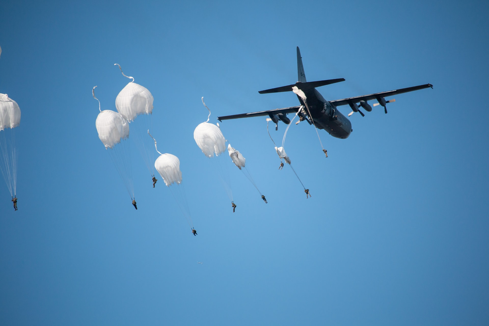

# Airdrop basics

We've now generated a wallet and connected it to the Solana blockchain. In the previous step, we confirmed that our account's balance is zero but wouldn't it be nice to fund our account so we can see the balance change?

You might be wondering whether we'll now need to transfer real money so we can test the account, but as we discussed in [Step 3](https://learn.figment.io/tutorials/solana-wallet-step-3), a blockchain's devnet typically provides a way to test transactions without risking real economic value.

In this step, we'll be building functionality to allow users to "airdrop" SOL tokens into their devnet account. In the crypto world, an airdrop is a way for the protocol to distribute tokens to account holders for free. 




Figure 5: We're about reinforce our supply lines with some devnet SOL

In this case, we'll be tapping into the native devnet airdrop functionality built into Solana to fund our account. This is in contrast to mainnet airdrops performed by blockchain protocols and crypto projects, which are usually issued to reward early adopters or contributors.


Protocols and companies use airdrops as a marketing technique to hype their launch and catalyze user growth. By issuing tokens to users that joined by a certain date or performed some action on the protocol, they can spread the word and, if the airdrop is successful, make more people aware of the solution they're building. For example, the Stellar Development Foundation performed a $125 million airdrop in late 2018 to get Stellar Lumens in the hands of crypto users and try to boost mainstream adoptions.

On the right side of the wallet dashboard, you'll find a button with the label **Airdrop**. You might notice that this button goes away if you change the network. This is because the functionality we're implementing is only active for devnet. Moreover, you'll notice a tooltip help icon informing users that they'll receive 1 devnet SOL by clicking on **Airdrop**.

Once we've completed this step, our balance will automatically increase when we click **Airdrop**. This will position us well for [Step 5](https://learn.figment.io/tutorials/solana-wallet-step-5) where we'll build functionality to send funds to other Solana accounts.

# Implementation 🧩

In [Step 3](https://learn.figment.io/tutorials/solana-wallet-step-3) we learned how to instantiate a connection to one of Solana's networks, and how to assign our account's public key property to a variable. We can apply that same code here to start writing the `handleAirdrop` function in `utils/index.ts`:

```javascript
const connection = new Connection(clusterApiUrl(network), "confirmed");
const publicKey = account.publicKey;
```

## Airdrop function

Following our previous heuristic of searching the docs for keywords, we can now search for "airdrop" to see if there's a function we can leverage. Lo and behold the `Connection` class has a `requestAirdrop` function that looks promising. It takes in two properties - `to: PublicKey` and `lamports: number` - and returns a `promise` that resolves to a string.

You might be wondering what a "lamport" is. Solana's native token, SOL, is divisible into 1 billion lamports. You can think of lamports as the cents to SOL's dollar.



Figure 6: This is also a lamport. Leslie Lamport is the lamport's namesake. He's a computer scientist who has made key contributions to distributed systems


It's not clear from the documentation, but after a little research you can confirm that the returned string represents a confirmation ID or `signature`. From a function design standpoint, it seems reasonable that to request an airdrop we should pass in the account address (public key) and the amount of funds we're requesting.

```javascript
const confirmation = await connection.requestAirdrop(
  publicKey,
  1000000000
);
```

The above function will work just fine and our users will be able to airdrop 1 SOL every time they click on the button. But you can clean it up a bit by importing and passing in the `LAMPORTS_PER_SOL` constant, which itself equals one billion, from web3.js.

```javascript
const confirmation = await connection.requestAirdrop(
  publicKey,
  LAMPORTS_PER_SOL
);
```

## Confirming airdrop

Finally, before we can refresh our account's balance automatically, we need a way to make sure the blockchain ledger has been updated with our airdropped funds before we call `refreshBalance`. As with any database-type operations, blockchain state changes are asynchronous. In fact, given the decentralized nature of most blockchain protocols, some updates [can take a while](https://twitter.com/CryptoKitties/status/937444644740198400?s=20).

With that in mind, we need to wait for the airdrop to be confirmed before refreshing the balance. Searching the docs once again, we can see that our `Connection` class includes a `confirmTransaction` method that takes in a confirmation `signature` and `commitment`, and returns a `promise` that resolves once the transaction is confirmed by the network.

```javascript
await connection.confirmTransaction(confirmation, "confirmed");
```

Note that we don't need to assign a variable to the confirmation here. Once our wallet knows that the transaction was confirmed by the network, it can call `refreshBalance` and update the balance for the account.

```javascript
return await refreshBalance(network, account);
```

Avid readers might have noticed that the balance in our account looks wrong. It reads one billion SOL when it should read 1 SOL. Now that we know what lamports are, how they relate to SOL, and how to use the `LAMPORTS_PER_SOL` constant, we can go back to our `refreshBalance` function and fix the bug by updating its return value.

```javascript
return balance / LAMPORTS_PER_SOL;
```



Figure 7: Getting close to the summit

We've come a long way and now have a better idea of how blockchain protocols work. We built a wallet by creating a keypair, connected to the network, fetched data from it, and successfully requested test tokens. We've covered all of the basic Web 3 interactions except the most important one - transferring funds. We'll do that next in [Step 5](https://learn.figment.io/tutorials/solana-wallet-step-5), so brace yourself.

##### _Listing 4.2: Code for airdropping funds_
```javascript
const handleAirdrop = async (network: Cluster, account: Keypair | null) => {
  if (!account) return;

  try {
    const connection = new Connection(clusterApiUrl(network), "confirmed");
    const publicKey = account.publicKey;
    const confirmation = await connection.requestAirdrop(
      publicKey,
      LAMPORTS_PER_SOL
    );
    const result = await connection.confirmTransaction(confirmation, "confirmed");
    return await refreshBalance(network, account);
  } catch (error) {
    console.log(error);
    return;
  }
};

const refreshBalance = async (network: Cluster, account: Keypair | null) => {
  if (!account) return;

  try {
    .
    .
    .
    return balance / LAMPORTS_PER_SOL;
  } catch (error) {
    .
    .
    .
  }
};
```

# Challenge 🏋️

If you open the browser's console from the `/wallet` page, and click on the **Airdrop** button, you'll notice a message that reads, "Airdrop functionality not implemented yet!". Navigate to `utils/index.ts` in your editor and follow the steps included as comments to finish writing the `handleAirdrop` function. We include a description along with a link to the documentation you need to review in order to implement each line. The relevant code block is also included in [Listing 4.1](#listing-41-instructions-for-writing-airdrop-function) below.

##### _Listing 4.1: Instructions for writing airdrop function_
```javascript
const handleAirdrop = async (network: Cluster, account: Keypair | null) => {
  // This line ensures the function returns before running if no account has been set
  if (!account) return;

  try {
    // (a) review the import guidance on line 1
    // (b) instantiate a connection using clusterApiUrl with the active network passed in as an argument
    // Documentation References:
    //   https://solana-labs.github.io/solana-web3.js/classes/Connection.html
    //   https://solana-labs.github.io/solana-web3.js/modules.html#clusterApiUrl
    console.log("Airdrop functionality not implemented yet!");
    const connection = "";

    // (c) get the key using one of the accessors on the account passed in as an argument
    // Documentation Reference: https://solana-labs.github.io/solana-web3.js/classes/Keypair.html
    const publicKey = "";

    // (d) request the airdrop using the connection instance
    // Note that you should include the amount to airdrop (consider using the LAMPORTS_PER_SOL constant from the web3.js library)
    // Documentation Reference: https://solana-labs.github.io/solana-web3.js/classes/Connection.html
    const confirmation = "";

    // (d) confirm the transaction using the connection instance and the confirmation string returned from the airdrop
    // Documentation Reference: https://solana-labs.github.io/solana-web3.js/classes/Connection.html
    const result = "";

    // (e) Refactor the refreshBalance function to return balances in SOL instead of Lamports (Hint: LAMPORTS_PER_SOL)

    // This line returns the balance after the airdrop so the UI can be refreshed
    return await refreshBalance(network, account);
    // (f) You can now delete the console.log statement since the function is implemented!
  } catch (error) {
    console.log(error);
    return;
  }
};
```
