# Introduction
Hey Reader! Welcome to this Tutorial on How to write, deploy & interact with a smart contract on Tezos in SmartPy. We will be learing a lot and having fun alongside!
You will be able to understand the industry standards of coding on SmartPy and be able to deploy your own Calculator Smart Contract whilist Understading the code as well.

- Tezos is an open-source blockchain protocol for assets and applications backed by a global community of validators, researchers, and builders. The Tezos protocol is secure, upgradable, and built to last.
- SmartPy is an intuitive and powerful smart contract development platform for Tezos and is available through a Python library for building and analyzing Tezos smart contracts.


# Prerequisites

To complete this tutorial, you will need a basic understanding of the Python programming language. Everything else will be explained, from getting XTZ from the faucet to coding and deployment.


# Requirements

You will need to have Temple Wallet Installed in your browser. Get it from https://templewallet.com/


# SmartPy IDE
SmartPy is a high-level smart contracts library and comes with related tools in the form of [SmartPy.io](https://smartpy.io/) to greatly ease the accessibility, understandability and provability of smart contracts on Tezos.

So head over to [SmartPy.io](https://smartpy.io/) and let us begin writing our first smart contract in Python!


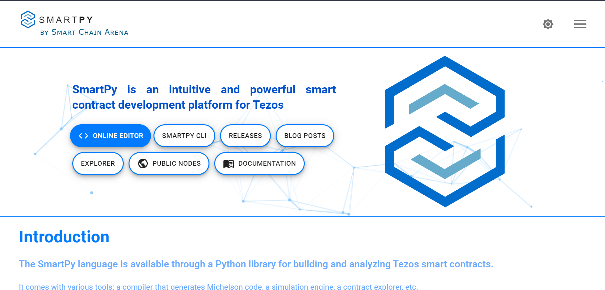

For our purposes, the important links on this page are:
- [Online Editor](https://smartpy.io/ide)
- [Documentation](https://smartpy.io/docs/)

The Online Editor will help us write , execute and test our code before it is deployed on the blockchain and Documentation will help us with various DataStructures , Conditions , DataTypes and much more!

Click the Online Editor button to go to the IDE page:

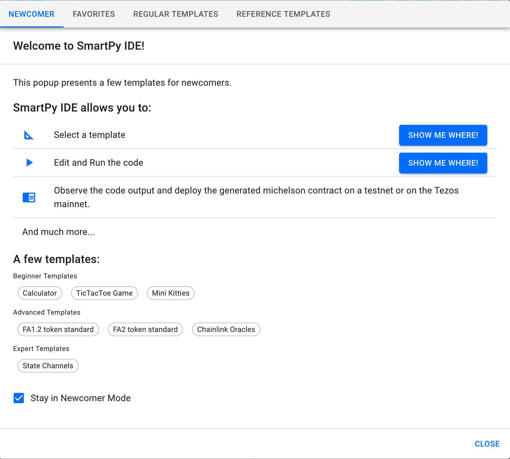

Here SmartPy has provided us with various templates and sample contracts including games, token contracts and some basic utility contracts.
We will be coding our own version of a Calculator contract that is present as one of the examples.

Go Ahead and click on the **Close** button.

Before we start writing the code of the smart contract itself, we need to cover some of the basics:
We will be importing the SmartPy library and using it throughout the smart contract.

```python
import smartpy as sp
```
The functions of SmartPy can thereafter be called with the prefix `sp.`

Python does not support direct conversion of Python code to Michelson, so we will have to use functions present in SmartPy:
- sp.if
- sp.else
- sp.verify
- sp.for
- sp.while

You can read more about the usage of loops and conditions in SmartPy in the [Documentation](https://smartpy.io/docs/)

In SmartPy, smart contracts are essentially Python classes which have to be inherited from `sp.Contract` .
All the class attributes will be taken as the contract storage, and all the class methods will be considered as entrypoints of the contract which we can call from a front-end (client side) to change the state of the contract.

> **NOTE**: No change will take place in the contract unless called by the user via an entrypoint.

Now on to Coding our Contract:

Create a Python class that inherits the class `sp.Contract` and define its storage:

```python
class Calculator(sp.Contract):
    def __init__(self):
        self.init(value = 0)
```
Here we have defined a variable named *value* and set its initial value as 0.

As mentioned previously, Python does not support direct conversion of Python code to Michelson, so we use different data types as well. For example:
- sp.TInt 
- sp.TBool
- sp.TTimestamp
- TBytes

As well as Tezos specific data types like:
- sp.TAddress
- sp.TMutez
- sp.big_map

You can read more about all the types and why SmartPy uses type inference in the [Documentation](https://smartpy.io/docs/)

Moving on, we will define our first method (entrypoint). We have to write `@sp.entry_point` before we define a method so that the compiler knows that whatever code follows is an entrypoint:

```python
@sp.entry_point
    def add(self, x, y):
        self.data.value = x + y
```
The `add` function takes two parameters x and y and stores their sum in the variable we defined before: value, which is accessed by `self.data.value`.

With these concepts, we can create all the entrypoints needed for a Calculator contract:

- Subtract
```python
@sp.entry_point
    def subtract(self, x, y):
        self.data.value = sp.as_nat(x - y)
```

- Multiply
```python
@sp.entry_point
    def multiply(self, x, y):
        self.data.value = x * y
```

- Divide
```python
@sp.entry_point
    def divide(self, x, y):
        self.data.value = x / y
```

Now it's time to put all the entrypoints together and create our contract:

```python
import smartpy as sp

class Calculator(sp.Contract):
    def __init__(self):
        self.init(value = 0)

    @sp.entry_point
    def multiply(self, x, y):
        self.data.value = x * y

    @sp.entry_point
    def add(self, x, y):
        self.data.value = x + y

    @sp.entry_point
    def subtract(self, x, y):
        self.data.value = sp.as_nat(x - y)

    @sp.entry_point
    def divide(self, x, y):
        self.data.value = x // y

    @sp.entry_point
    def square(self, x):
        self.data.value = x * x

    @sp.entry_point
    def factorial(self, x):
        self.data.value = 1
        sp.for y in sp.range(1, x + 1):
            self.data.value *= y
```

You will notice that I have added two EntryPoints named `square` and `factorial`. These are to demonstrate how we do basic Python operations with SmartPy.

# Test Scenarios
Before we move on to deploying our contract on the Tezos network, we need to first make sure all of the code is working as we expect it to by testing it. Once deployed, smart contracts are immutable (and we do not want to waste our XTZ tokens).

Let's examine the concept of **test scenarios** :

Test scenarios are an important tool to make sure our smart contracts are working correctly.
- A new test is a method marked with `@sp.add_test`
- A new scenario is instantiated by `sp.test_scenario`.
- Scenarios describe a sequence of actions: originating contracts, computing expressions or calling entry points, etc.
- In the online editor of SmartPy.io, the scenario is computed and then displayed as an HTML document on the output panel.

Let's start by defining a method named `test()`:

```python
@sp.add_test(name = "Calculator")
    def test():
        pass
```
Now we need to instantiate (also known as originate) our smart contract and create a test scenario:

```python
@sp.add_test(name = "Calculator")
    def test():
        ob = Calculator()
        scenario = sp.test_scenario()
```

Now we can call all our entrypoints and see in the output panel if the value is being updated correctly:

```python
@sp.add_test(name = "Calculator")
    def test():
        ob = Calculator()
        scenario = sp.test_scenario()
        scenario.h1("Calculator")
        scenario += ob
        ob.multiply(x = 4, y = 2)
        ob.add(x = 4, y = 2)
        ob.subtract(x = 11, y = 5)
        ob.divide(x = 15, y = 3)
        ob.square(x = 3)
```

Now that the code has been tested and works properly, we will need to get some Tezos tokens on the testnet so that we can pay for deployment.

# Faucet and Temple Wallet
Before we can deploy anything, let's first get some Testnet ꜩ from the [Tezos Faucet](https://faucet.tzalpha.net/).

On the Faucet page, complete the CAPTCHA Verification and you will be given a faucet key, which looks like this:
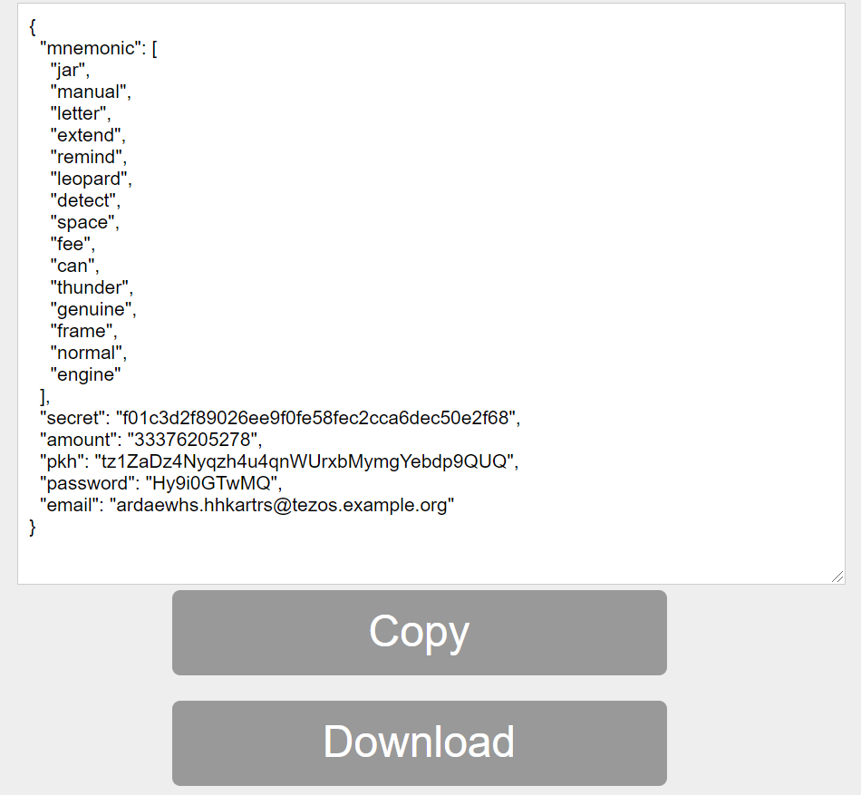

Download and keep this JSON file in a secure location as it contains the secret key and mnemonic which will be used for deployment of the smart contract we have created.

Now Open your Temple Wallet and click **Settings** > **Import account**:

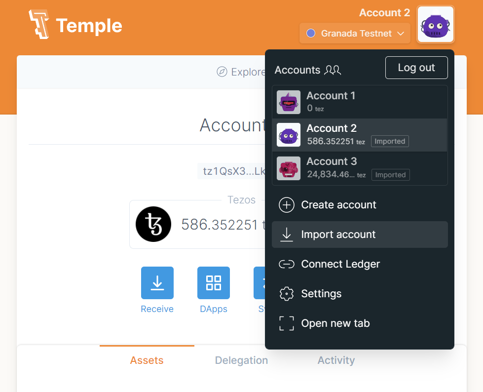

Now select Faucet File as the source and upload the JSON file you got from the faucet:

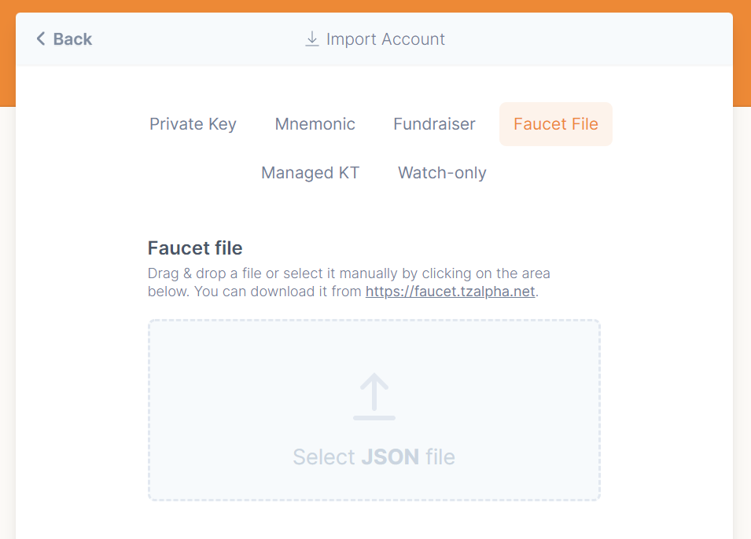

Now that we have a funded wallet on the Tezos testnet, we can move on to deploying the code.

# Deployment

Coming back to SmartPy.io:

```python
import smartpy as sp

class Calculator(sp.Contract):
    def __init__(self):
        self.init(value = 0)

    @sp.entry_point
    def multiply(self, x, y):
        self.data.value = x * y

    @sp.entry_point
    def add(self, x, y):
        self.data.value = x + y

    @sp.entry_point
    def subtract(self, x, y):
        self.data.value = sp.as_nat(x - y)

    @sp.entry_point
    def divide(self, x, y):
        self.data.value = x // y

    @sp.entry_point
    def square(self, x):
        self.data.value = x * x

    @sp.entry_point
    def factorial(self, x):
        self.data.value = 1
        sp.for y in sp.range(1, x + 1):
            self.data.value *= y
            
    @sp.add_test(name = "Calculator")
    def test():
        ob = Calculator()
        scenario = sp.test_scenario()
        scenario.h1("Calculator")
        scenario += ob
        ob.multiply(x = 4, y = 2)
        ob.add(x = 4, y = 2)
        ob.subtract(x = 11, y = 5)
        ob.divide(x = 15, y = 3)
        ob.square(3)
```
Go ahead and run this code in the SmartPy IDE (click on the "Play" button at the top left) and in the Output panel on the right side, you will see the option to **Deploy Michelson Contract**:


You will be be redirected to the Origination page of the contract. On this page we have to select on which Node we wish to deploy our contract. Check your Temple Wallet and the JSON you got from the faucet in the previous section and select the appropriate Node. Then Click on the Temple Wallet option and connect your wallet to SmartPy.io:

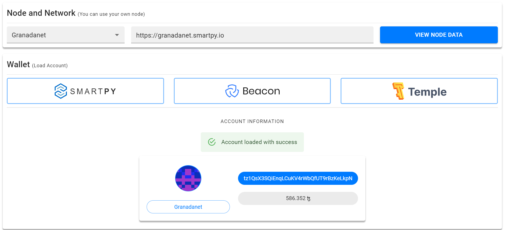

Scroll Down and click **Estimate Cost From RPC** and then click on **Deploy Contract**:

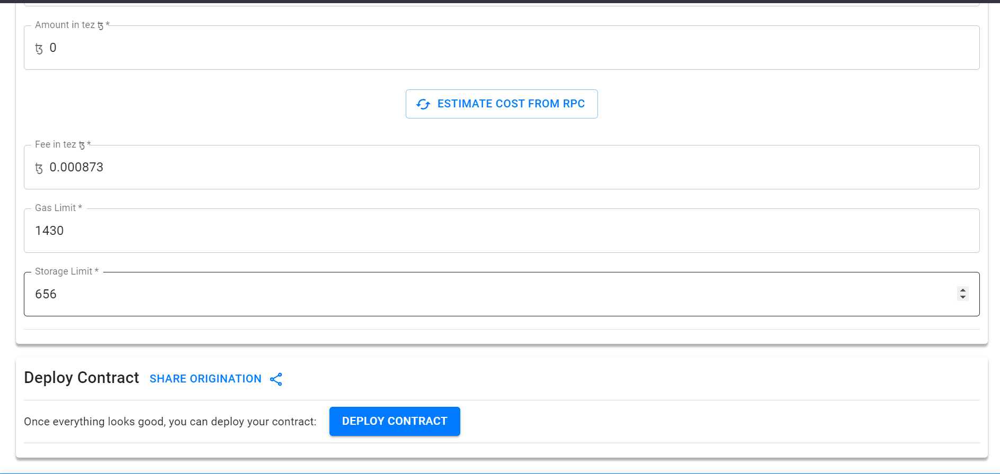

Then in the pop-up that appears click on **ACCEPT** and then Temple Wallet will open up and you will need to click on the **SIGN** button.

Once the transaction is confirmed, your contract will be deployed on the Granada testnet.

Copy the contract address as seen on the screen and wait for at least 3 block confirmations.

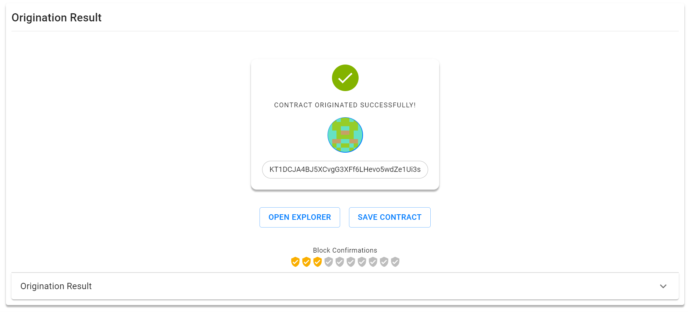

# Interacting with the contract

Now we are at the final step of this tutorial. We are going to learn how to explore our contract on-chain and how to interact with it.

Copy your contract address and head over to [Better Call Dev](https://better-call.dev/). Paste the contract address in the search box and press Enter.

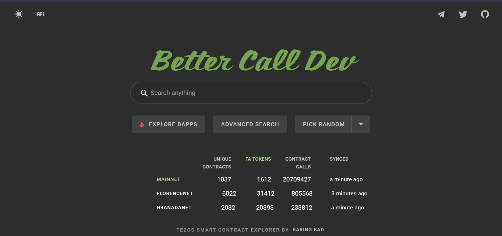

You will now be able to see your contract details. If they do not appear, wait for a couple of minutes and then refresh the page as it takes some time for the block confirmations to arrive after you have deployed the contract.


On the **Interact** tab, you will be able to see all your available entrypoints there with the input parameters that we specified.

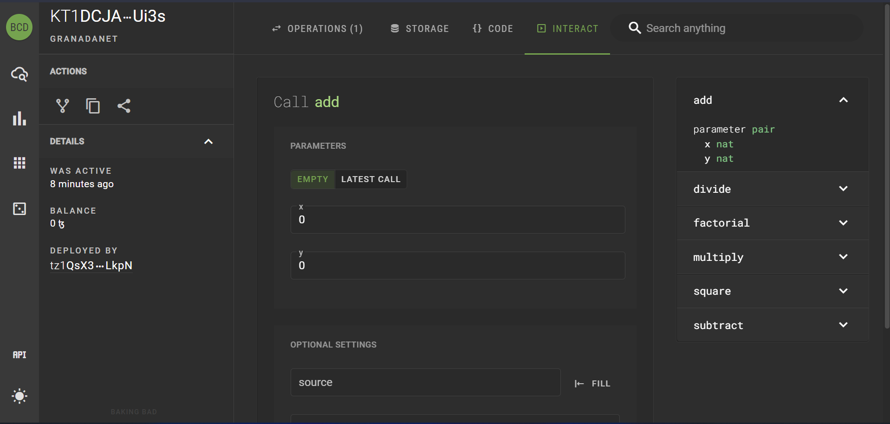

Now we will call our `add` EntryPoint!

1. Select **add** from the right-side pane (the list of entrypoints).
2. Put integer values in **x** and **y** fields.
3. Add your wallet address as the **source** and leave the **amount** field blank.


One of the best features of Better Call Dev is that we can simulate any transaction without having to spend any XTZ. So click on **EXECUTE** and choose **Simulate**. BetterCallDev will simulate the transaction and tell us if it is valid or will it fail and also what changes it will make to the contract's storage.


Now it is time to complete our first on-chain interaction!

This time, click on **EXECUTE** and Select **Temple - Tezos Wallet** instead of **Simulate**.

It will pop up your Temple Wallet and ask you to sign the transaction. It will also tell you the gas fee you are paying to complete the transaction:

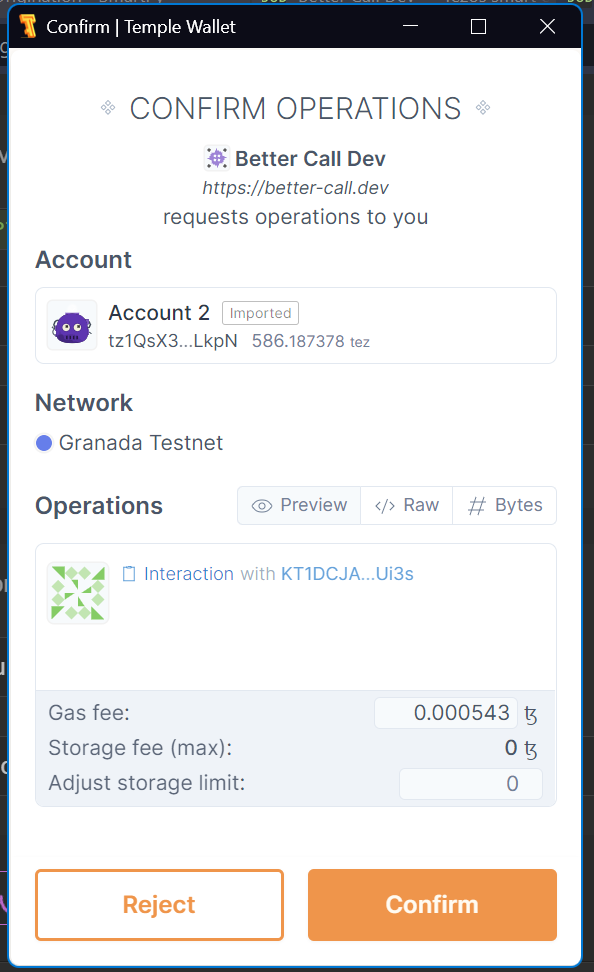

Finally, go to the **Operations** tab on BetterCallDev and you will be able to see your transaction and all of its details:

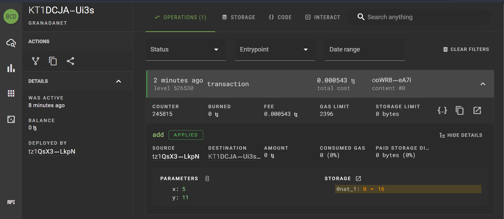

As we can see our transaction changed the **value** in storage to the sum of the parameters we supplied to the `add` entrypoint (i.e. 5 + 11 = 16).


# Conclusion

In this Tutorial we learned about coding in SmartPy, how to get testnet XTZ from the faucet, how to deploy a contract on the blockchain and how to interact with the contract using a block explorer. We also saw how our entrypoints can change a contract's storage.

# Next Steps

I would like for you to try out all the entrypoints that we have created and check what changes they make to the storage! Once you are comfortable with this basic contract you can go about creating more complex contracts, NFT tokens and much more.

# About The Author

This tutorial was written by Udit Kapoor, who is a Tezos India 2.0 Fellow and a blockchain enthusiast. Their signature project is CryptoWill and they like to dabble in Flutter as well! Reach out to Udit on [GitHub](https://github.com/Udit-Kapoor) and you can find them on Discord as user **pichkari#56**.

# References

- Calculator example code from SmartPy.io
- [OpenTezos](https://opentezos.com/)

